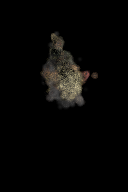
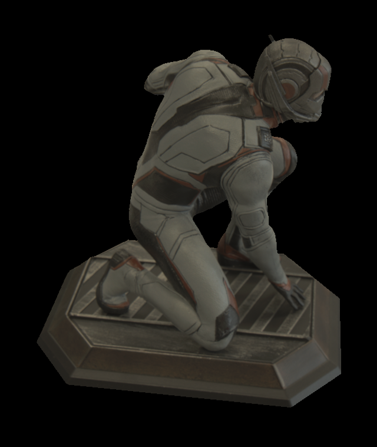
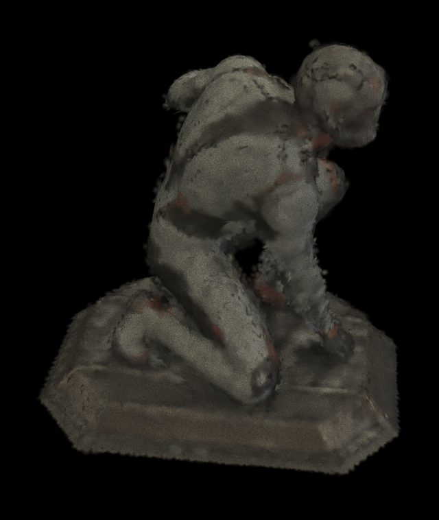
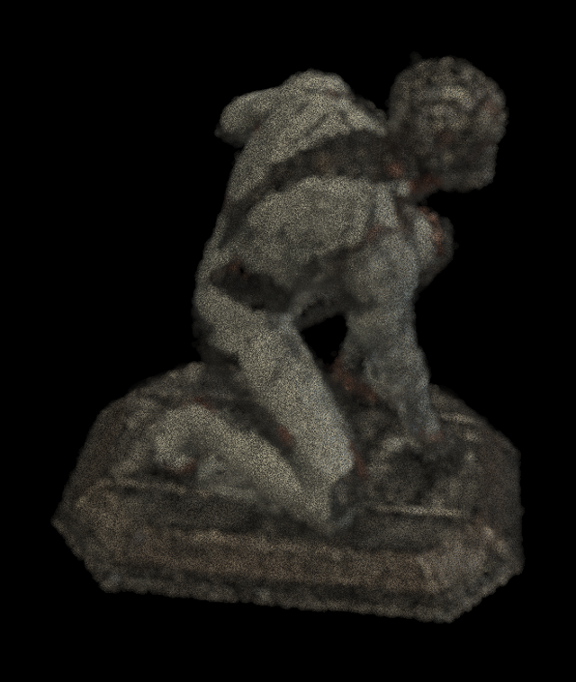

# blade-volume

Point-cloud-native volumetric rendering methods based on Blade graphics. The
runtime scene contains clouds only: Gaussian, RadFoam, PowerFoam, and future
point-sampled representations. Triangle meshes are accepted solely as offline
conversion input, never as a runtime geometry fallback.

The longer-term goal is a phone-video → reconstruction → interactive viewer pipeline.
Training lives in a separate crate built on [meganeura](https://github.com/kvark/meganeura);
no Python, no Burn. See `docs/AUDIT_AND_ROADMAP.md` for the audited status and
stage gates.

For the short, ordered path from today's result to a useful relightable asset,
see [`docs/RELIGHTING_ROADMAP.md`](docs/RELIGHTING_ROADMAP.md). It separates
the next surface, calibration, visibility, lighting, and material gates without
the experiment-by-experiment history in the audit logs.

## Relightable Pipeline at a Glance

- **Asset:** one point cloud carrying geometry, opacity, surface orientation,
  diffuse material, and optional view-dependent response. Runtime geometry is
  Gaussian, RadFoam, or PowerFoam; there is no polygon fallback.
- **Novel views:** working end to end from posed photographs, although fine
  geometry and boundaries remain softer than the source images. A short
  fixed-topology continuation under one aligned construction OLAT is now
  available at import time. On the fresh C452 statue it raises the extracted
  surface's held-camera whole/foreground result from `21.45/21.87` to
  `24.35/23.52` dB, recall from `97.2%` to `99.7%`, and precision from `75.6%`
  to `86.3%`.
- **Novel lighting:** working on controlled captures. The first OLATverse C276
  run holds out both 6/30 cameras and 103/207 lights. Its held-light/held-camera
  result is `33.67` dB whole-frame and `26.63` dB foreground at 128 pixels,
  essentially matching the fitted-light/held-camera quadrant (`33.72` /
  `26.69` dB). This is strong evidence that the measured-light path transfers
  rather than memorizes light IDs. On fresh C452, aligned-light geometry plus
  opt-in visibility reaches `36.90/30.92` dB whole-frame and `28.65/22.04` dB
  foreground mean/worst on held lights and held cameras.
- **Not solved:** the C276 handbag is still visibly soft, its gold hardware is
  not reconstructed as a specular material, and the worst grazing-light
  foreground is only `19.45` dB. Simply increasing C452 from 16,384 to 65,536
  cells improves precision and some tails but loses foreground means. The
  single-OLAT continuation improves every held-camera metric on both C452 and
  C276, but a few construction-camera minima move by `0.0001--0.0013` dB, so
  it remains an explicit geometry recipe rather than a hidden default. Three
  predeclared training-shard objects confirm that decision: on held lights and
  held cameras it raises Gaussian whole-frame mean by `0.16--0.26` dB and
  precision by `3.8--11.7` points, but C769 loses `0.50` recall points and two
  worst-image tails by about `0.003` dB, while C777 loses `0.24` dB foreground
  mean on construction cameras. A
  four-light, albedo-invariant response field sharpens C452 silhouettes but
  regresses C276 held-camera foreground by `0.14/0.19` dB mean/worst, so it is
  not promoted. A bounded display-space material update improves every mean
  on C452 and C276, but still loses one C276 novel-camera foreground minimum
  by `0.0048` dB; camera-support weighting only shrinks that loss to `0.0014`
  dB. Neither variant remains in the code.
- **Next:** finite lights now evaluate the existing GGX material fields and an
  optional finite-distance visibility ray without a new shader variant.
  Visibility gains about 2 dB on OLAT means but misses the strict gate by two
  0.001--0.002 dB foreground tails and regresses DiLiGenT-MV Bear, so it stays
  opt-in. Feeding the exact visibility factor into the diffuse solve lowers
  its linear objective but regresses C452 production renders, confirming that
  visibility without interreflection teaches the wrong material. Reconstructed
  materials remain explicitly diffuse-only because the first local specular
  fit also failed the complete image gate. A direct finite-light bounce is not
  enough either: four samples improve the aggregate worst case but lose mean
  quality and about 2 dB on individual construction images, so that prototype
  is removed too. Projected-footprint normal refinement has the same failure:
  it gains `0.058/0.042` dB mean while losing `0.324/0.289` dB on one image,
  and requiring every image to agree leaves no accepted update. Exact surfel-
  blend gradients confirm that this is representational: only 418/198/1 of
  6,840 surfels have a direction consistent across light/camera/image groups,
  and their bounded candidate still misses the tail gate. A first generic 15%
  densification grows C452 from 16,384 to 18,842 cells and improves the
  eight-light construction mean by `0.43/0.19` dB whole/foreground, but 68 of
  192 images regress and the worst foreground loss is 1.45 dB. More points
  alone are therefore not the answer. An exact-blend-ranked split of even one
  C769 disc improves the aggregate by `0.0021/0.0016` dB, yet regresses 43/35
  of 192 whole/foreground images and loses 0.031 dB on the worst foreground.
  Two smaller radial discs conserve area but cannot conserve the parent's
  optical support: their union necessarily has overlap or holes. Matching the
  full 104-light response does recover 25 coherent C769 sites, but 23 already
  lie inside an existing radial support and their normals differ by 52 degrees
  at the median. Appending them either before or after material fitting lowers
  the independent construction score. Exact PowerFoam partitioning fixes the
  overlap algebra but still loses foreground mean and 92/192 image tails; its
  best connected component improves both means yet loses precision and 30
  foreground images. Post-fusion insertion is therefore closed. Applying the
  same descriptor before fusion either removes support or, with exact fallback,
  lowers every aggregate. Training the density field directly on robust
  104-light albedo sharpens its outline but loses 0.94 recall points and up to
  2.20 dB on a construction image. Response invariance is a correspondence cue,
  not a replacement rendering target. Released C452 point truth puts the first
  large error in per-view density depth, before fusion. Five excluded polarized
  C769 cameras confirm 54.69/54.04/47.37-degree median unsigned normal error at
  density depth/pre-fit surface/post-fit surface, while the final fit leaves all
  surfel centers unchanged. The ordinary construction OLATs independently
  recover 24.66-degree photometric normals, so useful physical evidence is
  present in the captures. Applying it only after density tracing is too late:
  the strongest normal-guided depth candidate improves the excluded polarized
  normal check to 44.65 degrees after fitting, but loses 1.18 recall points and
  regresses 46 of 192 construction foreground images; even the weakest version
  loses the foreground mean and 86 image tails. That implementation remains an
  ignored diagnostic. Putting that constraint directly on differentiable
  expected absorption depth also fails. The density-only candidate changes
  whole/foreground means by `-0.0211/-0.0015` dB and regresses 106 of 192
  construction images; allowing site motion drops traced-hit coverage from
  `99.1%` to `97.0%` before material fitting. A per-view depth derivative can
  match a normal while leaving absolute layer and point ownership ambiguous,
  so the prototype is removed. Training the actual calibrated OLAT RGB and
  masks against density plus scratch-only shared normals/albedo is not enough
  either. Across a `0.01→0.0001` density-rate ladder, lower loss still trades
  optical support for average colour: the least destructive arm changes
  whole/foreground mean by `+0.0133/+0.0115` dB, but loses `0.0256` recall
  points, regresses 94/192 foreground images, and loses 0.329 dB in the worst
  pair. That implementation is removed too. A construction-only attribution
  check rules out cast-shadow deficit as the main cause: pixels whose opacity
  is lost have less negative radiance residual than stable pixels, while a much
  larger positive residual dominates every group. On the fitted surface,
  62.7% of within-surfel residual variance follows the light and only 5.1%
  follows the camera, but global light calibration and a half-vector specular
  proxy explain only 0.60% and 0.06%. The missing response is local to a point
  and light. Warming scratch normals and albedo before allowing density to move
  also fails: it raises traced-hit
  support from `99.1%` to `99.4%`, yet loses `0.150/0.175` dB
  whole/foreground mean, regresses 116/192 foreground images, and loses 1.61
  dB in the worst pair. The next shared objective must establish consistent
  cross-view first-surface ownership and preserve absolute depth/support before
  using unexplained radiance to move density. A scratch 104-way response per
  cell, shared across cameras and discarded before material fitting, is much
  safer than direct diffuse supervision but still changes whole/foreground
  mean by `-0.0026/+0.0019` dB, loses `0.0147` recall points, regresses 106/192
  foreground images, and loses 0.317 dB on the worst pair. Its implementation
  is removed. Radiance-driven density fitting is therefore closed until
  upstream multi-view evidence supplies an absolute first-surface association;
  visibility alone is not the missing switch. Light-specific appearance
  remains scratch-only. That upstream cue now works as a sparse diagnostic:
  four construction lights produce 579 C452 tracks, 97.6% pass a disjoint-
  camera silhouette check, and—only after selection—94.0% fall within one
  source pixel of released point truth. Applying their absolute depths through
  a global density continuation is rejected, however: it improves C452 truth
  depth slightly but changes construction whole/foreground mean by
  `-0.127/-0.038` dB, precision by `-0.455` points, and regresses 102/192
  foreground images. The next geometry experiment must propagate these
  independently measured anchors with local, support-conserving point-cloud
  corrections rather than another global radiance or density update. Denser
  matching reaches 1,332 selected tracks at 128 pixels and 3,831 at 256, but
  closes the obvious post-extraction routes: direct and smooth center motion
  improve some means while losing precision and 58--88 image tails; replacing
  normals loses both means; and a track-only cloud retains high precision but
  misses textureless regions. Seeding 1,297 dense tracks before ordinary image
  training is promising only while the sites remain free: after identical
  fitting it changes construction whole/foreground mean by
  `+0.160/+0.147` dB and recall/precision by `+0.656/-0.273` points, but still
  regresses 69/192 image tails. Hard-fixing those same centers proves why:
  traced support falls to 96.7%, precision loses 7.41 points, and 153/192
  images regress. A soft rendered-depth association is worse, collapsing
  traced support to 91.9%. Replacing the nearest lattice sites instead of
  distant low-density sites gives the strongest result: all five aggregates
  improve, including `+0.471/+0.310` dB whole/foreground and
  `+0.656/+0.609` recall/precision points. It still regresses 52/192 tails,
  however; locality filtering and appending sites are both worse. All scratch
  paths are removed. The predeclared 64K/256 scale check reduces median
  track-to-lattice displacement from `0.0441` to `0.0265` world units, but it
  makes the foam worse on every held-view metric and the extracted surface
  loses `0.36` dB whole-frame PSNR and `1.0` precision point. After identical
  material fitting, foreground mean rises `0.212` dB and recall `0.707` point,
  but precision falls `0.459` point, 60/192 image tails regress, and three lose
  more than 1 dB. The failures span cameras under every light. Response-track
  initialization is therefore closed without production code. Turning the
  same evidence into continuous point patches does not rescue it: broad local
  discs improve precision but lose `0.403` dB foreground and 152/192 tails;
  the repository's shared-view components and point-only midpoint resampling
  improve released point-truth geometry, recall, and precision, yet lose
  `0.317` dB foreground and the same 152 tails. Post-formation insertion is
  closed. Per-pixel multi-light signatures establish the next useful
  primitive: a fixed 27-light descriptor gives 99.32% within-one-pixel depth
  at width 64 and 96.18% at width 128, versus 50.0% for a four-light
  single-pixel response. Keeping every already-triangulated width-64 candidate
  yields 3,194 oriented tracks and 7,351 coherent point samples without
  reducing accuracy. They cover only 51.7% of the mask, however; rendering
  them alone or borrowing fallback support both fail badly. The next route is
  now tested: propagating scalar disparity along camera rays, checking it
  against independently solved views, and only then forming a point cloud
  yields 9,683 C452 surfels. On the untouched 103-light x 6-camera quadrant,
  its fixed candidate improves whole/foreground mean by `+2.356/+1.486` dB
  and precision by 6.84 points; every held-light mean and every held-camera
  mean improves. It is not selected yet: recall loses 0.312 point, 48/618
  individual images regress, and the same circular-support recipe fails on
  thin C769 geometry. Removing a redundant voxel-consensus pass grows C769
  from 2,793 to 7,619 surfels and a post-fit radius correction restores
  aggregate recall and improves precision by 3.04 points, but 90/192 images
  still regress. More verified points with resized circular discs is therefore
  also closed. Splitting the 1,802 voxels that contain conflicting surface
  sheets produces 9,698 surfels, but loses foreground mean, recall, and 98/192
  tails after fitting. Existing anisotropic Gaussians need no new shader, but
  both neighbor-covariance and source-mask-boundary initializations fail their
  same-cloud controls. Visibility is the useful clue: on frozen C769 models it
  changes the dense candidate's relative foreground gain from `+0.020` to
  `+0.428` dB and cuts regressions from 90 to 52. A degree-2 point-local
  light-direction residual is not enough: despite using 27 fitted construction
  lights and no light-ID lookup, it loses `0.077` dB on the fitted-light /
  disjoint-camera foreground and `0.104` dB on eight disjoint construction
  lights; stronger regularization still regresses 59/64 disjoint images. The
  exact overlapping-surface solve proves that pixel ownership matters: a
  four-coefficient light-direction oracle improves C769 disjoint-light
  whole/foreground by `+1.367/+1.602` dB and all 64 images improve, with
  coverage exactly fixed. It transfers only partly to C452, where the stronger
  regularized fit gains `+0.408/+0.404` dB but loses five isolated light/camera
  pairs by up to 0.180 dB. Sharing one transport factor across RGB and enabling
  existing visibility do not remove those tails. Spatial/normal smoothing and
  a degree-2 basis raise C452's mean gain to `+0.641/+0.705` dB, but still lose
  two light-156 views by up to 0.286 dB. A full direct diffuse+GGX refit is even
  more object-specific: it gains over 4 dB on C769 and regresses 60/64 C452
  images. A brightened failure frame shows the photograph's coherent dim
  backside where direct-light renders contain only grazing slivers. Removing
  the direct cosine from an additive transport oracle therefore models the
  right missing signal, and an sRGB-weighted half step improves all C769
  images, but still loses 10/64 C452 pairs. Adding a continuous degree-1
  light-by-view residual loses 13/64. More generic response capacity is now
  closed: no field, shader, operation, dependency, or format change is kept.
  Directly lifting construction-only photometric normals is not the repair
  either. Requiring two disjoint light folds, multiple source cameras, a
  15-degree cross-fold cone, and a 30-degree geometry cone changes only 285 of
  7,619 C769 points and gains `+1.075/+1.175` dB whole/foreground, but still
  loses four of 64 disjoint image tails; a half step loses three. Keeping those
  normals shading-only fixes coverage exactly and still loses 10/64 tails.
  Moving the same evidence before fusion raises recall by 0.50 points, but
  loses whole-frame mean, precision, and 29/64 tails. Per-image light gains
  vary by up to 4.2x in the repeated bad camera, while the light-099 photograph
  is broadly brighter but only 0.60 correlated with the concentrated direct
  render, ruling out one exposure scalar. A final scene-wide wrapped-diffuse
  test selects zero wrap; its remaining global gain still loses 12/64
  disjoint light/camera pairs, worst 0.329 dB. Broad backside response is not
  one shared half-Lambert lobe either.
  Multi-light Gaussian continuation is now guarded per fitted light/camera
  image rather than only by a pooled sparse audit; C769 regresses 426/432
  such images, so the candidate is restored exactly.
  The next route must jointly reconstruct the oriented point surface and its
  visibility/indirect transport through complete composited images, with
  per-image tail checks rather than a pooled appearance correction. C713/C777
  stay unopened by this response family; do not add polygonal geometry.

The exact OLATverse commands, split, metrics, decoder caveat, and artifact
paths are in [`docs/RELIGHTING_DATASETS.md`](docs/RELIGHTING_DATASETS.md).
Dataset terms do not currently state that photographs may be redistributed,
so OLATverse references and renders remain outside git. On the audit machine,
the current complete comparison set is under
`/mnt/data/OLATverse/runs/C276/olat-surface-128-r3c/images/`. The checked-in
gallery below covers datasets whose result images can be published. The latest
opt-in visibility candidate and its four-light contact sheet are under
`/mnt/data/OLATverse/runs/C276/olat-visibility64-r2/`. The fresh C452 controls,
all 1,236 held-light images, and latest contact sheet are under
`/mnt/data/OLATverse/runs/C452/olat-light000-visibility64-r2/`.
The latest dense-correspondence visual comparison is local-only because of the
same dataset terms. Its photo/control/candidate images are under
`/mnt/data/OLATverse/runs/C452/packed27-dense-radius-1.68-w128-all24-v1/light099-dump/`.

## Detailed Reconstruction Status

Short version: capture-light novel-view reconstruction works end to end. A
relightable surface is proven on controlled synthetic captures, but is not yet
a convincing real-world result.

- **Capture and poses — working.** A phone video or image burst goes through
  COLMAP and becomes posed photographs plus sparse points. An opt-in dense MVS
  stage now emits an oriented point cloud for the surface initializer. COLMAP
  remains an offline input stage; the output asset remains a point cloud.
- **Static light field — working, still soft.** Posed RGB images train a
  view-dependent anisotropic Gaussian cloud (`light-field.ply`) for novel views
  under the captured illumination. Real Room and Bonsai gates are recognizable
  but still lose fine detail and clean boundaries.
- **Surface cloud — implemented and dense-gated.** The pipeline extracts
  point positions, anisotropic support, opacity, and normals from the learned
  density field, or consumes an independently fused COLMAP point cloud and its
  normals. A leakage-free Bonsai gate improves relightable Gaussian geometry
  over its matched sparse control. A calibrated multi-light gate shows that a
  broad-light dense capture must share the rigid session and camera poses;
  registering a separately mounted object improves one held light but fails
  the two-light quality gate. It never converts the result to polygons.
- **Surface properties and relighting — controlled proof.** With aligned
  captures under measured lights, the pipeline fits a shared material table
  and renders held cameras under a light excluded from fitting. Diffuse albedo
  is selected; roughness and F0 are represented and rendered but not yet
  recovered robustly. Recovering
  geometry, unknown illumination, and especially specular properties from one
  ordinary real capture remains weak and underconstrained.
- **Cloud runtime — working.** The same viewer consumes static Gaussian and
  relightable Gaussian/RadFoam/PowerFoam assets; no mesh fallback is involved.
- **Real measured relighting — recognizable, not yet passed.** A same-session
  OpenIllumination gate builds dense point geometry from a broad all-LED stage
  capture, fits surface properties from five calibrated lighting patterns, and
  excludes two other patterns plus ten cameras from every fitting stage. The
  refined scalar cloud beats black and capture-light-copy on the object mask
  under both excluded lights; the Gaussian misses one foreground mean by only
  0.07 dB. Both still fail the dark whole-frame black baseline under one light,
  and the image below remains visibly speckled. This is now the blocking
  geometry/transport gate, not an unimplemented experiment. Exact commands,
  baselines, images, and next steps are in
  [`docs/RELIGHTING_DATASETS.md`](docs/RELIGHTING_DATASETS.md).
- **Controlled near-field route — first full-image LUCES-MV result.** The public
  calibrated Owl capture supplies masks, linear RGB16 images, ground-truth
  depth/normals, and 15 near-field LEDs at each of 12 poses. The CPU material
  solve and Gaussian Meganeura graph now share one finite point-light model,
  including inverse-square and directional falloff, with one calibrated light
  per view. Synthetic moving-rig tests pass on the RTX 5070, and a simple
  15-light real-data calibration check reaches 13.69°--19.69° mean normal error
  on three views. The pure-Rust LUCES adapter now loads all 180 Owl images,
  masks, camera poses, and camera-local LEDs without adding a ZIP/NPY
  dependency. A pure-Rust importer now feeds a predeclared 9/3-camera and
  12/3-light split into the ordinary pose-only cloud trainer. Fixing its
  dataset-scale far plane and sampling half of each masked batch on foreground
  raises held-camera static PSNR from 21.56 to 33.21 dB; the matched uniform
  control is 32.43 dB. A stock-Rust 16,384-cell run extracts 589 point surfels.
  The production relight tracer now accepts a finite emitter by mutating one
  uniform—no new shader group or shader entry—and renders the complete fixed
  light/camera cross-product. On the nine combinations excluded from every fit,
  the scalar cloud reaches 34.96/32.51 dB whole-frame and 25.51/23.28 dB masked
  foreground mean/worst, with 98.0% recall and 93.3% precision. The relightable
  Gaussian reaches 34.01/32.66 dB whole-frame and 24.13/22.66 dB foreground,
  with 94.9% recall. This passes the finite-light transport/plumbing gate; the
  final sparse material solve follows the runtime surface blend instead of
  assigning each blended pixel wholly to every projected point. The visibly
  soft result still does not pass the final surface-detail bar. Results
  are under `target/audit-runs/luces-mv/far-foreground-16k-rust-v1/`.
  Matched follow-ups rule out higher raster resolution, globally denser or
  locally resized support, construction-light averaging, subpixel colour
  reads, and naive epipolar light signatures: each improves a partial metric
  but loses a held camera/light tail. The next target is cross-view geometry
  correspondence and support, not simply more points. This compact baseline
  remains reproducible independently of the larger OLATverse gate.
- **OLATverse — first two-axis reconstruction complete.** The pure-Rust path
  reconstructs C276 without reading the released mesh, pseudo normals, or
  albedo. At 128-pixel fitting resolution, fitted and held lights are nearly
  indistinguishable on the six held cameras: `33.72/26.69` versus
  `33.67/26.63` dB whole-frame/foreground. A 65,536-cell arm improves static
  held-view PSNR, recall, and precision together, but after material fitting it
  trades 0.4 recall point for 1.3 precision points and leaves foreground PSNR
  effectively flat. The measured-light Gaussian optimizer worsens its
  representative loss `0.003033→0.010926`, so the pipeline now restores the
  established cloud. That guarded Gaussian reaches `33.37/25.86` dB
  whole-frame/foreground on held lights and held cameras, versus
  `34.46/27.22` dB for the surface cloud. The split and light transfer are
  validated. The finite-light runtime now evaluates direct GGX for materials
  with nonzero F0, without a new shader group or entry. A first local material
  solve reduces its own sampled residual but regresses the complete fitted and
  held-camera renders, so it is removed and calibrated outputs explicitly keep
  F0 at zero. A finite-distance visibility ray then improves OLAT means by
  1.4--2.3 dB, but loses two held-light foreground tails by 0.0011/0.0023 dB
  and remains opt-in. Geometry, coupled transport, and compositor-aware
  non-diffuse recovery remain the active quality gates.
- **Independent distant-light control — DiLiGenT-MV is connected.** A pinned,
  pure-Rust Bear route now imports 20 calibrated cameras and a fixed subset of
  32 out of 96 distant lights without reading the released mesh or normals.
  Twenty-four lights and 16 cameras fit the model; eight lights and four
  cameras remain closed until serialization. On their 32-way cross-product,
  the 2,267-surfel surface reaches `29.35/26.89` dB whole-frame and
  `21.16/18.12` dB foreground mean/worst, with 95.0% recall and 94.4%
  precision. Its Gaussian trades foreground/recall for whole-frame quality and
  precision, so the scalar remains the stronger control. A same-pixel diffuse
  oracle reaches 33.57 dB on the excluded lights, while denser extraction and
  all 88 construction lights fail the complete gate. This independently
  confirms that geometry correspondence—not missing light samples or material
  pixel ownership—is the next reconstruction bottleneck. A fresh Cow
  reconstruction also rejects complete-render normal polishing: means improve,
  but four fitted/held tails regress by up to 0.05 dB, so the probe and its
  point-light refinement plumbing are removed. The next Cow control succeeds:
  calibrated diffuse-albedo correspondences add 32 cloud-only surfels and
  improve every fitted/held camera/light mean and tail. Held/held foreground
  moves `19.74/17.55→19.75/17.59` dB and recall
  `84.68%→85.50%`, while precision also rises slightly. The calibrated-albedo
  estimator is landed. The multi-pass correspondence and patch selection stay
  diagnostic: a direct one-pass form loses final Cow tails, while the exact
  Bear repeat finds one small patch but loses internal validation recall.
  A fresh Pot2 repeat gets closer: seeding nine surfels before joint fitting
  improves every final Gaussian mean, recall, and precision, but still loses
  two foreground tails by `0.0054/0.0028` dB, so it is also rejected. Fitting
  only those new materials worsens the validation tail further. Using
  24-light photometric albedo as the geometry image, alone or blended 25%/50%
  with the original view, also fails novel-camera transfer; mask pruning and a
  matched particle budget do not repair it. A first alternating-light
  prototype improves all Pot2 means but loses fitted-camera tails and
  regresses Cow; it is removed. A stricter follow-up puts four light stacks in
  one optimizer and gives each light independent nuisance SH while sharing the
  cloud. Frozen density improves every Pot2 average, recall, and precision,
  but still loses fitted-camera worst views by up to 0.070 dB; trainable
  density also loses held-camera recall. The experimental grouping API is
  removed. Per-light appearance can explain the photographs without
  identifying better geometry, so the next surface route must use measured
  lights and shared material response in the image-formation objective, not
  another free appearance table or proxy image. One extra physical
  geometry/material round validates that direction—it improves every internal
  mean and tail at a 15% checkpoint—but is still removed after held/held
  foreground mean slips by 0.0041 dB. Localizing that checkpoint to three of
  eight construction-selected spatial regions clears every Pot2 metric, but
  Cow selects no region and Owl rejects the union; the generic selector adds
  over 300 lines and about 47% to the clean Pot2 fit for a 0.00009 dB held/held
  foreground-mean gain. It stays diagnostic. The next version needs connected
  point patches derived from the physical residual, not a global octant scan.
  That control shrinks Pot2's safe update to four connected components and 52
  points while improving every final metric, but Cow accepts none and Owl's
  21-point union fails internal validation. Complete-render component probing
  therefore also stays diagnostic. One-pass physical attribution removes the
  probe cost but not the gate failure: raw position-gradient magnitude picks
  an unsafe Pot2 patch, while compositing-weighted residual identifies one of
  the previously safe selection patches yet loses validation worst-case PSNR
  by 0.00013 dB. Cow similarly gains means but loses tails, and Owl has no
  connected update whose full Gaussian footprint stays inside every
  construction mask. A signed displacement audit across four camera groups
  narrows Pot2 to two agreed interior components (22 points), but their union
  still loses validation worst-case PSNR by 0.000096 dB. Both attribution
  graphs and APIs are removed. Three hard-ray sampling controls are removed as
  well: unweighted foreground balance over-expands Pot2, importance correction
  still loses precision and one validation tail, and uniform no-replacement
  image coverage passes Pot2 but loses Cow validation quality and recall. The
  frozen-tail controls fail too: a top-decile pixel mixture loses Pot2 tails,
  while a worst-camera continuation improves validation strongly but moves the
  loss into the independent selection tail and recall. The next physical
  control must diagnose and reconcile camera-group gradient conflict, not
  merely reweight the same objective. That audit finds severe conflict on Pot2
  and Cow, but both strict agreement and PCGrad projection make Pot2 broadly
  worse; they are removed. The conflict belongs to the current image model,
  not just its optimizer. A frozen two-object shadow audit also finds almost no
  correlation between visibility variation and gradient conflict, so no
  shadow-aware loss is added; exact `T×alpha` camera ownership is equally
  uncorrelated, so gradients are not gated by view support either. Frozen
  half-vector lobes then correlate with individual residuals in the wrong
  direction, so no specular term is added to the physical geometry fit. Only
  about 15--16% of physical observations duplicate a center pixel, rejecting
  an exclusive-owner rewrite. Universal footprint mixing also fails to predict
  residual on both objects, so no demixing rule is added. Residual variance
  then splits differently between camera and light on Pot2 and Cow; the next
  bounded test fits only shared diffuse albedo through the exact Gaussian
  compositor, but even a 12.5% continuation loses Pot2 selection means. The
  one-site parameter branch is now closed. The released eight-site directional
  residual now has a viable staged fit: freeze the already-trained density/SH
  base, then fit only the residual table. The selected stage improves every
  held Room and Bonsai view; its useful horizon scales with table size (256
  updates for 98,831 Room sites and 510 for 200,000 Bonsai sites). Bonsai now
  reaches 21.6891/20.9944 dB over train/held views. The directional-only stage
  now compacts live path rows and drives its Meganeura subgraph from the GPU
  count. The selected short Room stage executes 31.2% of padded rows and is
  1.87× faster than its dense directional implementation; Bonsai executes
  20.2% and is 1.82× faster. Generic
  Meganeura changes skip untouched virgin Adam entries and fold a gathered
  repeated row into its existing reduction; they add no operation or shader
  variant. Frozen scalar constants no longer expand to the full directional
  tensor, and frozen checkpoint state remains authoritative instead of being
  redundantly uploaded and read back. All reproduce their dense controls'
  rounded metrics. Against matched current no-table controls, Room is 1.74×
  slower and the median of three Bonsai pairs is 1.99×, so the staged table
  now passes its two-scene production-cost gate. It remains staged rather than
  part of the joint base fit. A fresh Buddha repeat
  also rejects the correspondence route before held data:
  calibrated-albedo tracks form no complete-render-safe patch under the
  default neighborhood, and wider or photometric-normal
  variants trade selection means against tails. Commands and the full matrices
  are in
  [`docs/RELIGHTING_DATASETS.md`](docs/RELIGHTING_DATASETS.md).
  A fifth untouched Reading reconstruction produces a coherent 16-surfel
  proposal, but its construction-only selection gain does not survive disjoint
  internal validation: every PSNR measure and recall rises slightly, while
  precision falls by 0.00017 percentage points. The candidate is rejected
  without opening its official held split. This closes further threshold
  tuning of post-hoc sparse patches; the next surface route must recover
  connected support during reconstruction.
  A frozen follow-up inserts the same proposal before the ordinary calibrated
  material/normal solve and opens the official split only after serialization.
  It retains 1,455 rather than 1,441 Gaussians and raises recall slightly, but
  lowers precision and every Gaussian PSNR mean/tail. Held-light/held-camera
  foreground moves `18.4652/16.0847→18.4523/16.0560` dB, so early sparse
  seeding is rejected too.
  Perspective-normal integration grows the verified patch to 500 point
  samples, but even requiring three cameras to emit the same voxel leaves 12
  surfels that still lose validation precision and whole-frame mean.
  Independent dense stereo over the 24-light photometric-albedo images is the
  first materially stronger route: on Reading it recovers 12,136 cloud
  surfels and restores visible book/face/clothing detail. After replaying both
  arms with the final-material serialization fix, its held-light/held-camera
  Gaussian reaches `29.11/26.47` dB whole-frame and `18.61/15.78` dB
  foreground, against the sparse control's `28.91/26.47` and
  `18.75/16.31` dB. Coverage also falls, so neither default nor 1.7× support is
  selected. The importer emits only construction-light albedo images, poses,
  and the nearest-camera PatchMatch graph; no held input, released geometry,
  or polygonal intermediate enters reconstruction. The frozen Cow repeat and
  four proxy-image/support controls fail as general solutions.
  A direct observation-level follow-up now compares the albedo and world-normal
  residuals for each of their two depth hypotheses instead of encoding another
  RGB proxy. It improves all 24 Cow values over albedo stereo and 22 of 24 on
  Reading. The selected depth maps retain 7,631/12,560 surfels and the fits
  retain 7,577/12,524 Gaussians. They still pass only 7 of 24 Cow values and 15
  of 24 Reading values against the corrected sparse controls: extra recall and
  foreground means trade against tails or precision. The selector therefore
  remains an ignored diagnostic. Exact source provenance then rules out post-fit
  centre clamps, ray ownership, observed normal thickness, tangent-mask bounds,
  source-pixel material replacement, and explicit mask loss: all trade image
  quality against support, and the one Reading-safe opacity compensation fails
  unchanged on Cow. A sparse-anchored connected dense layer then loses recall
  without gap fill and precision with it. Existing masked PowerFoam continuation
  becomes numerically neutral after conversion back to Gaussians. An exact
  oriented-cell reference then recovers nearly all foreground but over-covers
  it. Mapping the stored three-sigma radius to its 50%-coverage contour restores
  the Gaussian mask, yet hard per-cell shading remains about 3 dB behind;
  ownership-specific albedo recovers only 0.3--0.5 dB and normal fitting
  regresses. Smooth local albedo gains another 0.6--0.7 dB, but the repeat from
  exact final Gaussian centers/scales still trails by 2.0--2.4 dB. Keep
  PowerFoam PBR experimental; do not add model/runtime APIs for this rejected
  transfer—or another proxy image, support threshold, or polygonal fallback.
  A final fixed-Gaussian residual audit now separates those concerns: only
  about 10% of Cow error comes from missed foreground, while 81--84% lies on
  already-covered foreground. A 12-fit/12-held-light material control gains
  0.9--1.3 dB, and photometric normals plus material gain 3.1--3.3 dB. Directly
  transferring those normals to fixed particles still fails: even exact
  exclusive owners correspond to widely different released surface normals
  across cameras. Existing particles are not broad enough for the standard
  split, and expanding already-fused groups loses nine recall points. Filtering
  depth observations upstream at 15, 30, or 45 degrees also opens foreground
  holes or loses image quality. The closest 30-degree arm gains 0.04 dB
  whole-frame mean but loses foreground mean and about 1.1 recall points, so no
  callback API is retained. The next gate clusters one geometric observation
  set into multiple normal-coherent point groups. That improves diagnostic
  normal identity but duplicates optical support and loses 0.32 dB selection
  mean. Keeping support frozen and updating only 367 reliable normals/materials
  passes every internal and held-light metric, then loses 0.022 dB on untouched
  held cameras. Neither path is retained. Further cluster-attribute work moves
  to a fresh Bear reconstruction with camera and light splits reserved up
  front. Its 1,290 reliable updates improve selection and validation worst
  views, but normal-only still loses 0.058/0.039 dB validation whole/foreground
  mean; refitting diffuse albedo widens the loss. The held splits remain
  unopened, the branch is closed, and it adds neither a mesh nor another
  renderer.
  A fixed-Bear residual audit then localizes the remaining error: 78% lies on
  covered foreground; a coverage oracle gains only 0.8 dB, while cross-light
  photometric normals plus diffuse response gain 3.8--5.0 dB. Those normals
  are accurate to 5.6--7.5 degrees median, but final Gaussian ownership has
  only 0.498 cross-view normal consensus versus 0.927 in the source fusion
  groups. Resetting centers is neutral. Uniformly shrinking support to 1.0
  loses about 12 recall points; shrinking only the 4,049 groups called mixed
  by both light folds still loses 3.5 points and both internal means. The next
  gate must preserve optical mass while making physical response local within
  a point support; another normal loss, center prior, or radius threshold is
  not justified. A CPU oracle then keeps geometry and alpha exact while
  selecting spatially separated normals inside 463 Bear supports. It improves
  every Bear internal mean/tail, but the unchanged Cow replay's 97 supports
  lose 0.002/0.004 dB validation whole/foreground mean; normal-only is worse.
  No intra-point table, model field, or shader is added. Future geometry work
  needs independently anchored points, not more attributes on ambiguous
  support. An even smaller exact-alpha control that shades each surface group
  with only its maximum-response Gaussian also fails badly: the winner carries
  just 58% of median group weight and exclusive shading loses 0.8--1.0 dB
  mean. Preserving all weights while collapsing each group to one averaged
  tangent still loses every mean/tail. Compositor ownership is not a
  correspondence fix. A fresh 640 px Bear reconstruction then raises the cloud from
  11,543 to 26,105 points and ownership consensus from 0.498 to 0.601, but
  loses about ten recall points and 1.2--1.4 dB mean. Scaling radii by the
  point-density area ratio raises consensus to 0.617 and restores recall, but
  loses 3.6--3.9 precision points and every PSNR aggregate. Resolution alone
  therefore adds contradictory optical layers. A truth-vertex-cloud diagnostic
  (positions/normals only; faces are never parsed and truth never enters
  training) confirms that the fine data are not simply bad: median geometric
  error improves from 1.99 to 1.34 source pixels and median normal error from
  37.2° to 26.6°, but the catastrophic distance tail grows from 27.9 to 48.1
  pixels. Reusing up to eight nearest fine samples as spatial physical-response
  sites inside the exact coarse alpha improves hard-view tails, yet loses
  0.26--0.91 dB whole means; local ownership remains wrong. Reducing that 640
  px cloud to the original point budget while retaining whole groups also
  fails: the existing distinct-view/confidence rank loses 0.53--0.58 dB mean,
  and making
  two-fold photometric-normal consensus primary raises median ownership from
  0.498 to 0.517 but destroys about 24 recall points and loses 1.80--2.06 dB.
  Coherent interior samples are not a substitute for silhouette support. A
  final exact-pipeline depth-residual tie-break preserves aggregate source
  pixels but lowers median ownership to 0.442 and loses about ten recall
  points. Ranking by rare source-image tiles raises 128-scale tile coverage
  5.9%, yet likewise lowers ownership to 0.441, loses 0.83--0.89 dB mean, and
  drops about ten recall points. Group ranking is closed: 2D observation
  coverage is not 3D surface identity. Following retained source observations
  into a narrow support recovery restores 31 of only 40 suppressed particles and
  improves most values, but loses 0.0029 dB selection mean and precision on
  both splits. Broad support collapse is not the Bear bottleneck, and no
  recovery policy is retained. One-to-one snapping of the accepted coarse
  support to unique 640 px groups inside each existing radius also lowers
  ownership, 0.27--0.32 dB mean, and 2.6--2.8 recall points. The
  higher-resolution geometry branch is closed. Finally, an exact-compositor
  direct GGX oracle fitted only on construction folds selects a maximally broad
  lobe and loses every disjoint selection/validation mean and tail. No direct
  specular point-light shader or fitting API is added; this global lobe absorbs
  reconstruction error instead of exposing a stable surface property.
  Generated models, renders, and telemetry are under
  `target/audit-runs/diligent-mv/{reading-16k,cow,bear}/`.

The staged directional-residual models and telemetry are under
`target/audit-runs/directional-staged-validation/`; the selected longer Bonsai
result and horizon screens are under
`target/audit-runs/directional-staged-horizon/`. Compact-path performance and
parity screens are under
`target/audit-runs/directional-compact-frozen-scalar/` (with preceding
implementations under `directional-compact-gather-fused/`,
`directional-compact-record-128/`,
`directional-compact-parallel-sort/`,
`directional-compact-cooperative/`,
`directional-compact-spatial/`, and `directional-compact-indirect/`). These
generated artifacts remain outside version control.

Held-camera surface renders under three lights excluded from fitting. LUCES-MV
Owl is first; DiLiGenT-MV Bear is second. Relighting responds, but geometry and
fine surface detail remain visibly soft.


The sharper DiLiGenT-MV Reading diagnostic compares, left to right, the held
photograph, corrected sparse baseline, albedo-stereo cloud, and direct
albedo/world-normal depth-selection cloud. Rows are three held lights at one
held camera. The selected-depth cloud recovers structure but retains visible
speckle and does not pass every quality/coverage tail.


- **Independent natural-light relighting — first honest result, not yet
  passed.** The Objects With Lighting Ant-Man gate trains on 52 cameras under
  one unknown HDR environment, reserves 12 same-environment cameras, then
  scores nine official camera/environment pairs that were never loaded during
  fitting. A 25,000-point scalar cloud reaches 21.88/20.16 dB foreground
  mean/worst with 99.6% mask recall. The image is recognizably relit, but its
  grey, soft appearance loses most texture and material detail. Ordinary
  Gaussian fitting collapses foreground support. Restoring only initialized
  two-sigma footprints that agree with at least 97.5% of construction-mask
  samples raises official recall from 60.8% to 69.6%, precision from 95.8% to
  96.0%, and mean/worst quality from 19.28/17.39 to 19.64/18.07 dB. This is a
  selected safety recovery, not a solution to the grey appearance.
  On the independently prepared OWL Apple split, the healthy fit retains 86.1%
  of its inputs and recovery is an exact no-op.
- **Fresh-object support result — selected; sampled transport now works.** On a
  second painted, concave object, rejecting dense samples outside the training
  silhouettes before downsampling raises held-camera foreground quality by
  1.08/1.49 dB mean/worst and precision by 14.2 points. Both excluded lights
  improve. The PBR Gaussian renderer now evaluates visibility and one bounded
  bounce together under an arbitrary novel environment: eight samples improve
  excluded pattern 006 by 0.56/1.01 dB whole-frame and 0.51/0.67 dB foreground
  mean/worst. The result is still visibly speckled and too bright, so this
  clears a renderer boundary rather than the reconstruction-quality gate.
  An independent fabric-toy run confirms the narrower surface result: scalar
  known-light foreground improves `18.22/16.00→18.27/16.14` dB and precision
  `91.1→93.2%`. Its Gaussian whole-frame score and one excluded light remain
  mixed, so the hull is selected only as scalar geometric cleanup—not as
  evidence that Gaussian transfer or relighting is solved.
- **Final Gaussian colour transfer — selected and automatic for large
  individual tables.** The final compositor attributes about 71% of fabric-toy
  RGB error to already covered foreground, not missing support. A large table
  created in individual-material mode now fits one
  conservative global diffuse gain in the final Gaussian renderer instead of
  issuing thousands of material proposals. Exact matched controls improve
  known-view and both excluded-light mean/tail PSNR on the painted and fabric
  toys. A predeclared fresh metal sculpture then improves all twelve image
  aggregates with exactly unchanged geometry, selecting the transfer as an
  automatic final pass. All three objects still lose to trivial held-light
  foreground baselines, so light/surface recovery remains unsolved.
- **Broad specular response — promising, explicit diagnostic.** On the fixed
  metal-sculpture Gaussian, `--render-transfer-specular` conservatively moves
  25% of base colour from diffuse albedo into the rough specular response.
  Known-light foreground improves `17.08/14.92→17.56/15.49` dB; excluded
  patterns 005/006 improve to `15.59/14.37` and `15.88/14.46` dB. The latter
  two now beat capture-light-copy on the foreground, but not black. This is not
  automatic or reported as recovered metalness: the same transfer regresses a
  painted-toy known-light tail, while the free per-surfel lobe solver collapses
  below 20 dB under both excluded lights.
- **More material capacity — rejected for now.** A deterministic four-region
  lobe fit selects every region on both metal and paint, reducing exactly to
  the global diagnostic while retaining the painted primary-light tail loss.
  Every region alone hurts that same view, and sharpening roughness to 0.75 or
  0.5 is substantially worse. Moving the automatic diffuse fit from half to
  three fifths of the correction toward its optimum improves 83 of 84
  fixed-cloud mean/tail metrics,
  but the remaining painted whole-frame tail regresses even after a 1% move.
  The production safety factor is therefore unchanged.
- **Residual attribution — closed; surface ownership still blocks response
  recovery.** On three fixed clouds, a light-wide gain selected on construction
  cameras improves only 5--8 of 8 untouched cameras; the per-camera optimum
  spans 0.375--1.125 under the same emitters and repeats by camera/light across
  different objects. The same pattern remains on the analytic path, while
  8→64 transport samples cost roughly 6× more for only 0.01--0.37 dB mean
  improvement. This is not one exposure scalar or insufficient sampling. A
  regularized diffuse/F0 solve then improves every complete known-light
  validation cell and six of seven official light groups, but brightens false
  support enough to lose one whole-frame tail. Requiring stable multi-view
  evidence leaves only seven changed materials and a numerically neutral gain.
  Exact Gaussian ownership narrows this further but does not remove it: even
  materials with 100% foreground contribution at full resolution in all 30
  construction cameras still lose the same held whole-frame tail by less than
  0.001 dB while improving the other 27 of 28 official metric cells. Mask-only
  scale, scale/opacity, and tangent-plane controls fail too. No new material or
  radiometry path is selected: the next useful evidence is calibrated 3D
  correspondence at surface boundaries, after which the bounded response
  solve can be reconsidered.
- **Calibrated depth planes — useful evidence, not yet a stable update.** Exact
  source-camera provenance shows that the selected Gaussians sit roughly
  `1.2–1.6` local radii away from tight multi-view depth planes. A bounded
  post-fit correction improves two established real checkpoints, but an exact
  paired fresh reconstruction regresses every light group. It is therefore
  not in production. Distributing the correction through geometry training
  also fails at 2.5%, 0.5%, and 0.1% total motion before any held observation
  is opened. A fixed-center covariance screen then finds only numerically
  neutral axes and no validation-safe update. Center and endpoint heuristics
  are closed. Composited-depth loss fails both after low-resolution reduction
  and on 336,113 exact original source rays; one-sided free-space and local
  support-band losses fail independently as well. Dense fusion depth is useful
  provenance, but is closed as a regularizer on the fitted Gaussian basin.
- **Coherent point patch — internally positive, awaiting a fresh proposal.** A
  deterministic shared-view component keeps measured oriented points and adds
  point samples at local neighbor midpoints—no mesh intermediate. On the fixed
  painted-toy Gaussian, a 105-point patch at 0.05 opacity with one shared,
  conservatively scaled material improves every construction and disjoint-
  camera/light mean, tail, recall, and precision in an exact repeat. The gains
  are small and the official split was deliberately not reopened. Independent
  38-camera fabric and metal checks produce no points in actually missing
  foreground, so there is no second-object candidate and no production merge.
  The next gate is a new capture or dataset that supplies a non-empty coherent
  patch for an untouched final decision.

The next quality gate is deliberately narrow:

- distinguish support from appearance before adding points. Doubling the
  sculpture to 5,000 groups raises recall but loses 6.4 precision points;
  requiring three fusion views removes occluded layers but loses known-light
  quality. At 256 px, every independently triangulated selection-valid track
  already lies under the fitted Gaussian alpha. Four spatially shared response
  regions and sharper lobes also fail their independent gates. Keep geometry
  and materials fixed next; attribute the residual between calibrated light,
  visibility, and bounded indirect transport before adding capacity;
- assign cross-view ownership before increasing point count. A synthetic
  point-only sheet is already stable under deterministic 2× resampling, while
  the real 5,000-point cloud contains contradictory depth layers that its
  opacity optimizer correctly suppresses. The selected 2,500-point surface
  therefore remains the production checkpoint. Its paired COLMAP provenance
  confirms that every `min1` dense sample came from only one source image.
  Pose-only MVS now gets an explicit training-camera graph, Rust-native grouped
  depth fusion, and a replayable observation cache without fake geometry. The
  fixed 2,500/5,000-point gate is still mixed, so this remains opt-in. A
  complete-render static-light and calibrated scalar-PBR selectors were each
  tested twice and removed: scalar quality improves slightly, but rebuilt PBR
  Gaussians remain mixed or lose foreground quality. Scoring the same local
  alternatives in the learned Gaussian PBR compositor then selects none in two
  fits. A bounded additive follow-up then keeps only groups that under-cover
  foreground in a majority of their actual fusion source cameras. Its 76
  additions improve the scalar surface, but Gaussian training suppresses 72;
  the four fresh-rebuild survivors are image-neutral for Gaussian PBR and
  slightly regress the scalar surface. All temporary selection code is
  removed. A fixed-cloud alpha distillation then confirms that the scalar and
  Gaussian renderers differ, but making Gaussian alpha closer to the scalar is
  not sufficient: a foreground-balanced continuation raises teacher PSNR and
  recall while lowering held-photo tails and precision. That code is removed
  too. The scalar surfel remains a cloud-only quality output. A subsequent
  final-compositor diagnostic finds the dominant residual on correctly covered
  foreground and selects one conservative diffuse transfer for large material
  tables. It improves matched means and tails on two real objects without
  changing geometry. A predeclared metal-sculpture gate repeats every metric
  gain on the exact same cloud, so the large individual-table path is now
  automatic. Fixed-cloud attribution now also rejects a light-wide scale,
  more transport samples, covariance-derived normals, and a per-point broad
  response continuation: the last one improves the object but exposes false
  Gaussian extent in one held whole-frame tail. Geometry precision therefore
  remains ahead of more material capacity;
- require complete-render gains on separate construction/selection/validation
  camera sets, then on fresh held cameras and two excluded lights. Dense
  photometric normals, normal-guided integration, all-foreground tracks, and
  local multi-view depth sweeps have now all been screened without weakening
  this gate. A post-fit calibrated source-plane correction passes two stored
  checkpoints but fails a paired fresh optimizer basin, so the next candidate
  co-optimizes that evidence rather than mutating a finished cloud. That test
  also fails down to 0.1% total center motion; keep centers fixed and test a
  source-view covariance bound next. The covariance bound also fails before
  held data: use the calibrated observations as renderer depth targets rather
  than converting them to independent center or axis corrections. Do not
  front-reduce them onto the 128×192 RGB grid: that first attempt improves
  means but loses tails;
- keep the coupled visibility/one-bounce Gaussian path at four to eight samples
  in fitting and evaluation. Sixty-four samples and same-cost stratification
  do not pass the complete fixed-cloud gate. After surface ownership improves,
  calibrate per-capture exposure and unknown light before adding spatially
  shared roughness;
- generalize the aligned capture layout to `(image, camera, light, exposure)`
  observations only after those geometry and transport gates pass.

The concise evidence is below. Detailed protocols, experiments, and rejected
ideas live in
[`docs/GAUSSIAN_RECONSTRUCTION_PLAN.md`](docs/GAUSSIAN_RECONSTRUCTION_PLAN.md)
and [`docs/AUDIT_AND_ROADMAP.md`](docs/AUDIT_AND_ROADMAP.md).

## Workspace Structure

This repository is organized as a Cargo workspace:

```
blade-volume/          # Core library (no windowing dependencies)
blade-volume-view/     # Viewer utilities with winit (camera, input)
blade-volume-convert/  # glTF → point-cloud sampling
blade-volume-test/     # Image-reference regression harness
blade-volume-train/    # Meganeura-backed appearance training (COLMAP → foam)
```

## Preparing a phone capture

```bash
etc/colmap.sh --dense phone.mov etc/data/my-capture 3
```

This extracts video frames and runs COLMAP's sequential reconstruction into
the `images/` + `sparse/0/` layout consumed below. `--dense` additionally runs
geometrically consistent stereo fusion and writes `dense/fused.ply`, never a
mesh. Omit the flag when only poses and sparse points are wanted. See
[`docs/CAPTURE.md`](docs/CAPTURE.md) for recording guidance, failure checks,
and the direct Gaussian reconstruction command.

## Training a foam from a COLMAP scene

```bash
etc/fetch_test_dataset.sh bonsai                  # ~280 MB into etc/data/bonsai/
cargo run --release -p blade-volume-train --bin train_colmap -- \
    --sparse etc/data/bonsai/sparse/0 \
    --images etc/data/bonsai/images \
    --output  bonsai.ply \
    --novel-strip-prefix novel \
    --initialization radfoam-v1 \
    --width 24 --height 24 --views 8 --epochs 200 \
    --max-steps 24 --max-points 2000 --learning-rate 0.05
```

Outputs a binary RadFoam PLY plus a 5-frame interpolated-camera strip
(`novel_00.png` … `novel_04.png`). The PLY can be opened with the viewer
above. Add `--masks masks/` for a foreground directory mirroring the image
paths; masked runs supervise opacity and default its loss weight to 1. When a
second capture has the same cameras and filenames but different illumination,
add `--geometry-images aligned-light/ --geometry-steps-per-view 200` for a
short fixed-topology continuation before saving the foam. Its position rate
defaults to the selected `0.01` ratio and can be overridden with
`--geometry-position-lr-ratio` for constant/cosine schedules (the exact
`radfoam-v1` schedule keeps its absolute position rate); the ordinary
single-capture path is unchanged.
Object captures with a small masked foreground can opt into
`--foreground-fraction 0.5` to balance random foreground/background rays;
uniform image sampling remains the default. Set `--far-plane` in the scene's
own reconstruction units when the default 100 does not reach the object.
See `docs/PIPELINE.md` for the design and
`docs/MESH_TO_FOAM.md` for the parallel mesh-to-foam path.

## Current Reconstruction Results

The image-only pipeline now produces two cloud-only outputs from posed views:
a static anisotropic Gaussian light field, and a Gaussian surface with shared
PBR materials plus a recovered environment. No polygonal geometry enters
either reconstructed asset.

These are unedited outputs from persisted and reloaded point clouds. The Room
row shows a held camera under the captured light; the synthetic row holds out
both the camera and the studio environment used for the reference.

| Checkpoint | Reference | Reconstructed point cloud |
| --- | --- | --- |
| Room light field<br>held camera, captured light |  |  |
| Synthetic relighting<br>held camera, unseen studio light |  |  |
| OpenIllumination relighting<br>held camera and OLAT 000 |  |  |
| OpenIllumination same-session relighting<br>held camera and lighting pattern 006 |  |  |
| OpenIllumination fresh-object diagnostic<br>held camera and excluded pattern 006 |  |  |
| OpenIllumination sampled-transport diagnostic<br>same held camera and excluded pattern 006 |  |  |
| Objects With Lighting surface<br>independent camera and unseen natural HDR environment |  |  |
| Objects With Lighting Gaussian<br>same independent camera and unseen environment |  |  |

The pictures expose what PSNR alone hides: the light-field branch has the
scene and viewpoint but remains blurry, while the relightable branches respond
to new lights but lose sharp geometry, reflections, and support. The
fresh-object scalar row remains the strongest same-session surface checkpoint
selected without looking at patterns 005 or 006. The row below it holds the
same reference and shows the persisted PBR Gaussian with eight sampled
visibility/one-bounce rays: directional structure improves, but noise and
incorrect depth layers remain obvious. `--score-diffuse-samples 64` can clean
up scalar score dumps; Gaussian scoring deliberately stays at
`--diffuse-samples`, matching the transport used by the PBR reconstruction.

Objects With Lighting is the first row here where both the camera and natural
HDR environment come from an independent official test capture rather than a
held subset of the reconstruction session. Scores use the benchmark's
full-resolution object masks and its per-image exposure and colour-balance
alignment, so they are not directly comparable to the whole-frame table below:

| Ant-Man official unseen camera/environment | Foreground PSNR | Recall / precision |
| --- | ---: | ---: |
| 25k scalar surface (shown) | 21.88 / 20.16 dB | 99.6% / 95.7% |
| 25k mask-recovered Gaussian (shown) | 19.64 / 18.07 dB | 69.6% / 96.0% |
| 25k support-preserving Gaussian diagnostic | 20.44 / 17.95 dB | 87.1% / 92.5% |
| 25k ordinarily fitted Gaussian | 19.28 / 17.39 dB | 60.8% / 95.8% |
| Black | 10.84 / 8.60 dB | — |

Each PSNR cell is mean / worst over nine official pairs. The large margin over
black establishes real signal, not acceptable decomposition quality. Increasing
the point budget from 2,500 to 25,000 improves the scalar mean by 1.03 dB. By
contrast, the current single-environment Gaussian objective prunes or dims
useful foreground support. A stricter global survival threshold restores recall
but loses mean quality and precision, so that attempted change is rejected. The
selected local recovery restores 3,664 of those supports only after their
initialized footprints pass the construction silhouettes; it improves every
internal and official production metric while leaving healthy, maskless, and
multi-light fits unchanged.

| Gate | Training / held views | Static held PSNR | PBR held PSNR | Coverage |
| --- | ---: | ---: | ---: | ---: |
| Synthetic (PBR unseen light) | 6 / 2 | 25.06 / 24.34 dB | 18.90 / 18.68 dB | 56.4% |
| Synthetic (predefined light, refined) | 6 / 2 | 25.15 / 24.44 dB | 21.81 / 21.48 dB | 57.0% |
| Synthetic (four calibrated lights, five-cloud average) | 6 / 2 | 25.17 / 24.35 dB | 22.68 / 22.22 dB | 56.7% |
| Synthetic (full Gaussian PBR geometry, five-cloud average) | 6 / 2 | 25.50 / 24.52 dB | 23.65 / 23.03 dB | 55.3% |
| Synthetic (secondary-light foam continuation, five-cloud average) | 6 / 2 | 25.91 / 24.90 dB | 24.07 / 23.34 dB | 55.4% |
| Synthetic (denser calibrated capture) | 9 / 3 | 26.80 / 24.88 dB | 24.47 / 23.24 dB | 55.1% |
| Room (sparse COLMAP) | 18 / 2 | 20.30 / 19.61 dB | 14.94 / 13.54 dB | 69.3% |
| Bonsai (sparse COLMAP) | 18 / 2 | 16.84 / 16.54 dB | 14.51 / 14.43 dB | 82.6% |
| Bonsai (training-only dense MVS) | 17 / 3 | 18.52 / 14.59 dB | 15.80 / 11.66 dB | 63.8% |
| OpenIllumination patterns (scalar, excluded 005 / 006, 64-ray score) | 24 / 10 | 26.25 / 20.58 dB | 23.78 / 22.66; 22.97 / 20.81 dB | 9.0% |
| OpenIllumination patterns (Gaussian, excluded 005 / 006) | 24 / 10 | 26.20 / 20.56 dB | 22.96 / 20.69; 22.30 / 19.30 dB | 7.0% |
| OpenIllumination painted toy (filtered scalar, excluded 005 / 006) | 38 / 10 | 31.56 / 28.02 dB | 25.62 / 24.45; 24.04 / 23.04 dB | 8.8% |
| OpenIllumination painted toy (Gaussian material transfer, excluded 005 / 006) | 38 / 10 | 31.60 / 28.02 dB | 25.63 / 25.15; 24.32 / 23.24 dB | 8.8% |
| OpenIllumination metal sculpture (Gaussian automatic transfer, excluded 005 / 006) | 38 / 10 | 31.53 / 29.42 dB | 24.77 / 23.27; 25.11 / 23.09 dB | 8.1% |
| OpenIllumination metal sculpture (explicit broad-specular transfer, excluded 005 / 006) | 38 / 10 | 31.54 / 29.36 dB | 26.09 / 24.65; 26.40 / 24.40 dB | 8.1% |

The earlier OLAT-only two-axis gate is deliberately reported against trivial
baselines. On OpenIllumination `obj_16_friends_cup`, the static Gaussian under
captured OLAT 062 reaches 31.51/28.98 dB on the five official held cameras,
versus black at 31.10/28.46 dB. Under unseen OLAT 000, however, black scores
29.69/28.11 dB and copying the OLAT-062 photograph scores 30.30/28.16 dB. On
the object mask those baselines are 19.93/18.08 and 20.55/19.24 dB: the
foreground score removes the easy black background without hiding geometry
rendered outside the object. The relightable scalar cloud reaches only
23.62/20.61 dB whole-frame and 16.56/14.30 dB foreground at 14.1% frame
coverage. A
support-collapse guard now rejects the Gaussian fit when fewer than one quarter
of its input particles would survive. The fallback restores the established
surface at the production Gaussian cutoff rather than feeding rejected radii
back into it: all 638 particles persist, Gaussian frame coverage rises from
0.4% to 10.3%, and held-light quality reaches 26.12/23.89 dB whole-frame and
18.09/15.72 dB foreground. On the foreground mask, the scalar cloud has 73.0%
recall / 55.3% precision and the Gaussian has 61.4% / 63.5%; raw frame coverage
alone was misleading because the object occupies only a small part of each
image. The real relighting gate still fails both trivial baselines on the
object itself, but no longer hides that failure behind an almost-black render.
The comparisons show a fragmented, blob-like surface rather than merely a
miscalibrated BRDF. Denser source clouds, silhouette hulls, global support
widening, moving lattice sites, lower-order appearance, and extra sequential
lights have all failed a mean/tail/foreground cross-check. Broader calibrated
lighting alone improves only one unseen direction, but requiring one
per-particle albedo to explain five broad known lights improves both excluded
directions from the same asset. It remains below the complete trivial-baseline
gate; the next target is the fragmented surface and missing transport, not
another global radius or capacity knob.

Each PSNR cell is mean / worst held view. The current denser synthetic gate
and gallery use 200x150 final renders after the initial foam stage trains at
100x75; Room and Bonsai render at 128x85. The older synthetic rows remain as a
progression of controlled gates. The static columns always use the capture
light. Synthetic PBR uses a held-out environment; Room and Bonsai have no
relighting truth, so their PBR columns measure held poses under the recovered
capture light and must not be read as real-scene relighting accuracy.

<details>
<summary>Detailed reconstruction history and rationale</summary>

The Room and Bonsai rows are current-tree sparse-COLMAP reconstructions at
128x85. Both columns score persisted and reloaded cloud outputs; the PBR
column uses the volumetric Gaussian rather than the older scalar-surface
control. The exact commands, outputs, and cgroup/GPU telemetry are under
`target/audit-runs/tile-allocation-profile/`; repeated controls reproduce the
displayed values within the expected GPU-atomic band.

The dense Bonsai row uses a separate COLMAP model containing only the 17
training cameras; the three held cameras do not participate in PatchMatch or
fusion. COLMAP fuses 168,170 oriented points, which deterministic spatial
averaging and support filtering reduce to 49,844 PBR particles. A matched
sparse-only control reaches 14.33/10.64 dB PBR at 62.2% coverage; dense reaches
15.80/11.66 dB at 63.8%. The direct captured-light field deliberately retains
the sparse track cloud, where it reaches 18.52/14.59 dB. Using dense geometry
for both outputs regresses that static result to 18.13/13.59 dB, so the two
cloud outputs keep their independently gated initializers. This validates
dense surface support and normals, not relighting: Bonsai has no held-light
ground truth. The exact protocol is recorded in the reconstruction plan.

An independent full-resolution gate trains upstream 3DGRUT on Bonsai for
30,000 steps (`32.10` dB with 3DGUT, `29.37` dB through its reference 3DGRT)
and cross-renders the exported 1.26-million-particle PLY through Blade. Blade
agrees with the official 3DGRT images at `35.38` dB; the exact protocol and
performance controls are recorded in the reconstruction plan linked below.
The selected conservative 80-face proxy and 64-hit window render that gate at
`63.19` ms per 779x519 frame on the RTX 5070.

The predefined-light row is the fixed-cloud result after learned-density
normal initialization and the conservative complete-render normal, radius,
and material passes. Across five independently trained source clouds, the
final unseen-light PBR score averages 21.84/21.49 dB mean/worst at 56.7%
coverage. The density signal alone adds 0.11/0.11 dB over the otherwise
identical post-support pipeline and improves nearest-truth normal RMSE on all
five clouds. This is a controlled lighting milestone rather than an end-to-end
unknown-light result.

With four aligned captures under measured lights, the same five-cloud gate
improves unseen-light PBR quality to 22.52/21.95 dB. Photometric normals are
useful for the PBR surface but not for reproducing the original photographs,
so the static light field now keeps the pre-calibration Gaussian geometry and
fits its appearance and support independently. That restores static quality
from 23.62/22.95 to 24.97/24.22 dB while changing PBR by only
+0.01/-0.01 dB on average. A withheld training camera now decides whether the
static Gaussian geometry keeps the optional masked PowerFoam continuation.
It selects four improving clouds and rejects the one regression, raising the
five-cloud static result from 24.97/24.22 to 25.17/24.35 dB without exposing
the held-out test poses to either candidate. A conservative 20%
density-gradient correction after the calibrated normal solve improves every
one of the five held-light means and tails; single-light and static outputs
retain their gated 10% correction. Both outputs remain point clouds.

The same four aligned captures also supply a scalar-gain-normalized
correspondence image: per-pixel log responses are centered across lights, so a
multiplicative intensity, scalar reflectance, or exposure gain cancels before
the existing multi-view patch sweep. On an exact paired replay of five
post-continuation foams, this improves held-light Gaussian PBR by 0.05/0.06 dB
mean/worst and 0.08 dB where hit at unchanged aggregate coverage. `reconstruct`
enables it automatically for foam geometry when the primary measured capture
and at least three repeated
`--normal-images`/`--normal-environment` pairs are supplied. It remains a
cloud-only CPU refinement and adds no shader or model variant.

The PBR support fit uses masks only as negative visibility evidence: predicted
opacity is penalized on known background rays, but a foreground mask does not
force one of several overlapping particles to own that ray. The static light
field still receives full foreground/background mask supervision. This moves
the calibrated five-cloud PBR average from 22.52/21.95 to 22.68/22.22 dB
mean/worst, with 56.7% rather than 57.0% coverage; reduced Room and Bonsai
smokes remain non-regressive.

Retaining the learned Gaussian covariance and opacity for PBR rendering
improves all five calibrated clouds. After the selected response and compositing
corrections, the mean held-light score gains 0.60 dB, the worst view gains
0.49 dB, and covered-pixel quality gains 0.68 dB over the scalar surface.
Coverage remains 1.7 percentage points lower. Bounding each particle where its alpha response
falls below 0.03 removes weak overlapping tails, improving the fixed-cloud
volumetric score by another 0.10/0.11 dB while reducing its median render time
from 8.86 ms to 1.49 ms per 100x75 frame. A mild remap of only the retained
core then improves every five-cloud mean and tail and recovers 0.4 coverage
point without widening the acceleration proxies. Grouping overlapping hits
from the same thin depth layer into a partially saturated surface sheet adds
another 0.8 coverage point while improving every synthetic mean and tail. A
final 2.5% log-space residual of the already selected scalar radius refinement
then improves all five means and tails without changing learned ellipsoid
orientation or aspect ratio. The scalar surface remains faster at about 0.7
ms, but it is no longer the only practical interactive path. Full 18/2-view
Room and Bonsai gates put Gaussian and scalar rendering at 12.52/12.04 versus
12.49/12.01 dB on Room, while Gaussian wins 14.86/14.83 versus 14.69/14.40 dB
on Bonsai. Real captures have no held-light truth, so these remain
capture-light novel-view gates rather than relighting accuracy claims.

When two or more aligned captures have measured environments, the final PBR
Gaussian geometry also receives a short continuation under each known light.
One optimizer interleaves paired rays from every light while restoring the
pre-continuation appearance coefficients afterward. When every capture has a
mask, the same graph jointly updates particle centers and explicit diffuse
normals through the exact nine-term irradiance basis in linear radiance;
maskless or mixed captures retain the previous display-referred,
position-only path needed for low-radiance coverage. Covariance, materials,
durable SH, and the runtime representation stay fixed during this
continuation; dense masked captures may also recalibrate opacity as described
below. A weak foreground residual conditions at most 50%
of the color loss in proportion to detached predicted opacity, preventing
well-covered motion from repairing errors in frozen transmittance while
poorly covered and background rays retain the coverage-driving residual. The
existing exact-render material polish then accounts for changed overlapping
mixtures. A guarded label pass now ranks alternate entries from known-light
observations, tests only logarithmic prefixes through complete production
renders, and re-polishes the same table after an accepted change. It improves
every five-cloud held-light mean and tail, raising the single-light aggregate
from 23.50/22.93 to 23.65/23.03 dB at unchanged coverage. Joint normal fitting
followed by a short aligned-light contrast tail is automatic only for a
requested relightable Gaussian output under calibrated lights. These passes add
no training option, material field, shader, or dependency.

Before surface extraction, a 200-update-per-view continuation of the same foam
under one aligned secondary light improves all five independently trained
clouds. The volumetric Gaussian PBR aggregate rises from 23.53/22.97 to
24.07/23.34 dB mean/worst held-light PSNR, with coverage moving from 55.3% to
55.4% and covered-pixel quality from 22.52 to 22.89 dB. It is explicit because
it requires a separately captured, camera-aligned image directory. It adds no
shader, graph operation, model field, format, or dependency.

For independently fitted PBR support with at least eight training cameras,
the Gaussian schedule now starts at 0.25 rather than 0.5 peak opacity. Dense
multi-view surface samples otherwise begin nearly saturated and can leave the
support stage in a poor opacity/appearance basin. On the fixed nine-view foam,
this raises unseen-light Gaussian PBR from 22.59/20.94 to 24.15/22.97 dB while
the independently fitted static field was 26.03/23.95 dB before the later
covariance-rotation refinement. Six- and
seven-view fits retain their established 0.5 initialization, as does the
shared-appearance path, where lowering opacity did not generalize.

The later calibrated-light geometry pass also updates Gaussian opacity at a
conservative `0.005` rate when at least eight masked camera views are
available. This lets physical diffuse responses recalibrate transmittance
without changing covariance or durable appearance. It raises the denser
capture from 24.15/22.97 to 24.28/23.08 dB and a separate eleven-view fixture
from 23.28 to 23.36 dB. Six-view and maskless captures retain frozen opacity.

Low-order static Gaussian fields now learn their normalized quaternion
rotation together with scale, opacity, and position during the support stage.
The selected `0.001` rate raises the dense nine-view gate from a reproduced
25.99/23.90 to 26.61/24.79 dB and an independent eleven-view gate from 22.50
to 23.79 dB. Across five six-view cloud replays it improves every mean and
worst view, raising the aggregate by 0.38/0.21 dB. SH-2 fields and every PBR
support fit keep their extracted covariance frame fixed: joint rotation made
the scalar surface regress, while a later rotation-only transfer was neutral.
The implementation reuses ordinary differentiable graph operations and adds
no shader variant, graph operation, public option, model field, format, or
dependency. Its quaternion expansion doubles each vector component once and
reuses those products across the rotation matrix, removing redundant graph
work without changing that surface. Geometry refreshes also download learned
rotation with position, scale, and opacity in one transfer.

Those same low-order static fits now perform one residual-guided split halfway
through support training. They accumulate camera-scaled position-gradient
norms on the device, select the top 5%, and split only broad Gaussians into two
smaller children. The graph is rebuilt at the new particle count while every
survivor keeps its raw parameters, Adam moments, and optimizer step; only new
children start with zero moments. Across the five-cloud gate, every mean and
worst view improves and the aggregate rises from 25.352/24.434 to
25.504/24.523 dB. Dense and independent nested gates rise to 26.80/24.90 and
23.89 dB. Dense real clouds whose selected residuals are already narrow skip
the event, avoiding coincident opacity duplication. This remains a private
training policy and adds no shader, graph operation, public option, format,
model field, or dependency.

</details>

`reconstruct --gaussian-output light-field.ply --pbr-gaussian-output relightable.ply`
writes the two durable cloud outputs. `relightable.f32` stores the recovered
environment beside the PBR Gaussian. Each requested PLY is reloaded before its
final score, so reported quality includes serialization. Either output can be
requested alone; a PBR-only request runs the selected independent PBR schedule
without constructing or training a static light field. Current research
artifacts and complete logs are generated under `target/audit-runs/` and
intentionally remain outside version control. The exact protocols, negative
results, and artifact locations are recorded in
[`docs/GAUSSIAN_RECONSTRUCTION_PLAN.md`](docs/GAUSSIAN_RECONSTRUCTION_PLAN.md).

CI enforces workspace formatting, all-feature clippy with warnings denied,
default and all-feature tests, and a RustSec dependency audit.
The clippy policy mirrors `blade-graphics/src/lib.rs` and lives in the root `Cargo.toml`'s
`[workspace.lints]` block — keep both in sync.

## Unified Viewer

The `view` binary in `blade-volume-view` supports multiple rendering backends with shared camera controls.
The format is **automatically detected** by examining the PLY file header:

```bash
# Auto-detection (works for both Gaussian and RadFoam PLY files)
cargo run -p blade-volume-view -- <path_to_file.ply>
cargo run -p blade-volume-view -- <path_to_file.spz>

# Override auto-detection with --kind
cargo run -p blade-volume-view -- <path_to_file.ply> --kind=radfoam
cargo run -p blade-volume-view -- <path_to_file.ply> --kind=gaussian
```

### Controls

| Key | Action |
|-----|--------|
| W/A/S/D | Move forward/left/back/right |
| Z/X | Move down/up |
| Q/E | Roll camera |
| Mouse drag | Look around |
| Mouse wheel | Adjust fly speed |
| I | Print info (camera pose, GPU timings) |
| Tab | Toggle debug mode (particle density visualization) |
| L | Next environment (relightable point clouds) |
| Escape | Exit |

### Options

```
  --resolution <W,H>       Target resolution (e.g. 1920,1080)
  --cam-pose <x,y,z,r,p,y> Camera position and orientation (Euler degrees)
  --kind <gaussian|radfoam|surfel> Override format auto-detection
  --max-steps <N>          Max traversal steps (RadFoam only, default: 1024)
  --weight-threshold <F>   Stop when transmittance <= threshold (RadFoam only, default: 0.001)
  --min-opacity <F>        Minimum opacity for Gaussian rendering (default: 0.01)
  --min-transmittance <F>  Minimum transmittance for Gaussian rendering (default: 0.01)
  --environment <a.f32,b.f32> Lights for a relightable asset; without it the viewer
                           builds a sky and moves the sun around it
  --light <name|index>     Environment to open under (relightable only); L cycles
  --exposure <F>           Multiply radiance before the display curve. Without
                           it, the value is chosen from the environment's
                           photographic key, so any capture's units render
  --diffuse-samples <N>    Shadow rays per shading point (surfel only, default: 0)
  --specular-size <N>      Prefiltered environment width (relightable, default: 256)
  --debug                  Start in debug mode (particle density visualization)
```

## Relightable Surface Particles

The other representations store what a point looked like: the light that was
there when it was captured is already inside the number, and cannot be taken
back out. This one stores what the surface is made of — albedo, specular
reflectance, roughness, and an exact normal — and works out the radiance at
render time from whatever environment it is handed.

Convert once, then light it as often as you like:

```bash
cargo run --release -p blade-volume-convert -- model.glb --kind surfel --resolution 400
cargo run --release -p blade-volume-view -- model.surfel
```

The viewer opens framed on the asset with a procedural sky; `L` moves the sun,
and the model is not rebuilt between lights. `--environment` takes measured
environments instead, as the float planes blade's `relight_data` writes, and
`--light` picks which to open under. Exposure comes from the environment's own
key luminance unless you set it, because radiance arrives in whatever units
the capture used.

To reconstruct Gaussian particles from selected cameras of Blade's synthetic
relighting fixture and score both unseen poses and unseen illumination:

```bash
cargo run --release -p blade-volume-train --bin synthetic_reconstruct -- \
  --dataset /path/to/relight-data --output target/reconstruction.rply
```

This command is deliberately a depth upper bound: it fuses depth truth from
training views only, estimates normals from the resulting cloud, and fits
materials from radiance. It prints a matched truth-material control and never
uses held-out camera geometry for fusion. `--truth-normals` selects the earlier
normal upper bound. The image-only path and its current gap to this ceiling are
summarized above.

Scored against blade's canonical path tracer over six views of `police.glb`
under five environments, the direct-lighting path reaches **27.95 dB linear /
23.78 dB tone mapped at 0.7 ms a frame** (320x240, 235k surfels). Shadow rays
are available and are *not* an improvement: they buy visibility and one bounce
at seven times the cost, and against a four-bounce reference they score worse
than leaving both out. See `benchmarks/mesh_conversion.toml` for the numbers
and what they do not cover.

## Gaussian Blobs

Implementing [3DGRT paper](https://gaussiantracer.github.io/) with hardware ray tracing.


### Example

```bash
cargo run -p blade-volume-view -- /path/to/koala.ply --resolution 800,800 --cam-pose -2.6,-1.7,-0.8,0,73,-17
```

Some assets can be found in [GSOP](https://github.com/cgnomads/GSOPs/tree/91e1c34a92f2334a85a3545152d905c5403ee0e0/hip/splats/cleaned).

## Radiant Foam

Implementing the [Radiant Foam paper](https://radfoam.github.io/) with pure compute.


### Example

```bash
cargo run -p blade-volume-view -- "/path/to/Bicycle.ply" --resolution 1200,900 --cam-pose -1.278,0.002,1.267,-0.0,-57.4,-146.3 --max-steps 1024 --weight-threshold 0.001
```

## Debug Mode

Press `Tab` to toggle debug visualization mode, which shows a heatmap of:
- **Gaussian backend**: Number of particles hit per pixel
- **RadFoam backend**: Number of Voronoi cells traversed per pixel

The color scale goes from blue (few) → cyan → green → yellow → red (many).
