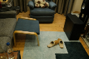
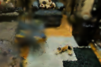
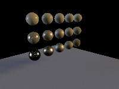
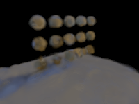
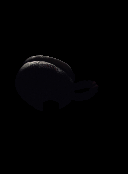
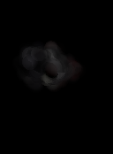
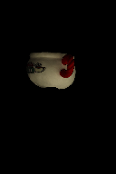
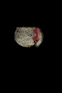
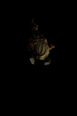
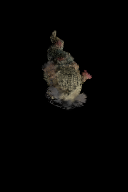

# blade-volume

Point-cloud-native volumetric rendering methods based on Blade graphics. The
runtime scene contains clouds only: Gaussian, RadFoam, PowerFoam, and future
point-sampled representations. Triangle meshes are accepted solely as offline
conversion input, never as a runtime geometry fallback.

The longer-term goal is a phone-video → reconstruction → interactive viewer pipeline.
Training lives in a separate crate built on [meganeura](https://github.com/kvark/meganeura);
no Python, no Burn. See `docs/AUDIT_AND_ROADMAP.md` for the audited status and
stage gates.

For the short, ordered path from today's result to a useful relightable asset,
see [`docs/RELIGHTING_ROADMAP.md`](docs/RELIGHTING_ROADMAP.md). It separates
the next surface, calibration, visibility, lighting, and material gates without
the experiment-by-experiment history in the audit logs.

## Reconstruction Status

Short version: capture-light novel-view reconstruction works end to end. A
relightable surface is proven on controlled synthetic captures, but is not yet
a convincing real-world result.

- **Capture and poses — working.** A phone video or image burst goes through
  COLMAP and becomes posed photographs plus sparse points. An opt-in dense MVS
  stage now emits an oriented point cloud for the surface initializer. COLMAP
  remains an offline input stage; the output asset remains a point cloud.
- **Static light field — working, still soft.** Posed RGB images train a
  view-dependent anisotropic Gaussian cloud (`light-field.ply`) for novel views
  under the captured illumination. Real Room and Bonsai gates are recognizable
  but still lose fine detail and clean boundaries.
- **Surface cloud — implemented and dense-gated.** The pipeline extracts
  point positions, anisotropic support, opacity, and normals from the learned
  density field, or consumes an independently fused COLMAP point cloud and its
  normals. A leakage-free Bonsai gate improves relightable Gaussian geometry
  over its matched sparse control. A calibrated multi-light gate shows that a
  broad-light dense capture must share the rigid session and camera poses;
  registering a separately mounted object improves one held light but fails
  the two-light quality gate. It never converts the result to polygons.
- **Surface properties and relighting — controlled proof.** With aligned
  captures under measured lights, the pipeline fits a shared PBR material table
  and renders held cameras under a light excluded from fitting. Recovering
  geometry, unknown illumination, and especially specular properties from one
  ordinary real capture remains weak and underconstrained.
- **Cloud runtime — working.** The same viewer consumes static Gaussian and
  relightable Gaussian/RadFoam/PowerFoam assets; no mesh fallback is involved.
- **Real measured relighting — recognizable, not yet passed.** A same-session
  OpenIllumination gate builds dense point geometry from a broad all-LED stage
  capture, fits surface properties from five calibrated lighting patterns, and
  excludes two other patterns plus ten cameras from every fitting stage. The
  refined scalar cloud beats black and capture-light-copy on the object mask
  under both excluded lights; the Gaussian misses one foreground mean by only
  0.07 dB. Both still fail the dark whole-frame black baseline under one light,
  and the image below remains visibly speckled. This is now the blocking
  geometry/transport gate, not an unimplemented experiment. Exact commands,
  baselines, images, and next steps are in
  [`docs/RELIGHTING_DATASETS.md`](docs/RELIGHTING_DATASETS.md).
- **Fresh-object support result — selected, transport still failing.** On a
  second painted, concave object, rejecting dense samples outside the training
  silhouettes before downsampling raises held-camera foreground quality by
  1.08/1.49 dB mean/worst and precision by 14.2 points. Both excluded lights
  improve, but the dark pattern-006 render remains far too uniformly lit. This
  separates useful surface cleanup from the next visibility/indirect-light
  task.

The next quality gate is deliberately narrow:

- turn the verified sparse correspondences into continuous local point-cloud
  patches, with shared or spatially regularized material parameters instead
  of copying one nearby point or fitting one free material per new point;
- require complete-render gains on separate construction/selection/validation
  camera sets, then on fresh held cameras and two excluded lights. The first
  fixed-base patch append passed the internal split twice but failed this final
  gate, so its merge implementation was removed;
- fit finite-light visibility, indirect transport, and then spatially shared
  roughness only after surface support passes on a second same-session object;
- generalize the aligned capture layout to `(image, camera, light, exposure)`
  observations only after those geometry and transport gates pass.

The concise evidence is below. Detailed protocols, experiments, and rejected
ideas live in
[`docs/GAUSSIAN_RECONSTRUCTION_PLAN.md`](docs/GAUSSIAN_RECONSTRUCTION_PLAN.md)
and [`docs/AUDIT_AND_ROADMAP.md`](docs/AUDIT_AND_ROADMAP.md).

## Workspace Structure

This repository is organized as a Cargo workspace:

```
blade-volume/          # Core library (no windowing dependencies)
blade-volume-view/     # Viewer utilities with winit (camera, input)
blade-volume-convert/  # glTF → point-cloud sampling
blade-volume-test/     # Image-reference regression harness
blade-volume-train/    # Meganeura-backed appearance training (COLMAP → foam)
```

## Preparing a phone capture

```bash
etc/colmap.sh --dense phone.mov etc/data/my-capture 3
```

This extracts video frames and runs COLMAP's sequential reconstruction into
the `images/` + `sparse/0/` layout consumed below. `--dense` additionally runs
geometrically consistent stereo fusion and writes `dense/fused.ply`, never a
mesh. Omit the flag when only poses and sparse points are wanted. See
[`docs/CAPTURE.md`](docs/CAPTURE.md) for recording guidance, failure checks,
and the direct Gaussian reconstruction command.

## Training a foam from a COLMAP scene

```bash
etc/fetch_test_dataset.sh bonsai                  # ~280 MB into etc/data/bonsai/
cargo run --release -p blade-volume-train --bin train_colmap -- \
    --sparse etc/data/bonsai/sparse/0 \
    --images etc/data/bonsai/images \
    --output  bonsai.ply \
    --novel-strip-prefix novel \
    --initialization radfoam-v1 \
    --width 24 --height 24 --views 8 --epochs 200 \
    --max-steps 24 --max-points 2000 --learning-rate 0.05
```

Outputs a binary RadFoam PLY plus a 5-frame interpolated-camera strip
(`novel_00.png` … `novel_04.png`). The PLY can be opened with the viewer
above. Add `--masks masks/` for a foreground directory mirroring the image
paths; masked runs supervise opacity and default its loss weight to 1. When a
second capture has the same cameras and filenames but different illumination,
add `--geometry-images aligned-light/ --geometry-steps-per-view 200` for a
short fixed-topology continuation before saving the foam. Its position rate
defaults to the selected `0.01` ratio and can be overridden with
`--geometry-position-lr-ratio` for constant/cosine schedules (the exact
`radfoam-v1` schedule keeps its absolute position rate); the ordinary
single-capture path is unchanged.
See `docs/PIPELINE.md` for the design and
`docs/MESH_TO_FOAM.md` for the parallel mesh-to-foam path.

## Current Reconstruction Results

The image-only pipeline now produces two cloud-only outputs from posed views:
a static anisotropic Gaussian light field, and a Gaussian surface with shared
PBR materials plus a recovered environment. No polygonal geometry enters
either reconstructed asset.

These are unedited outputs from persisted and reloaded point clouds. The Room
row shows a held camera under the captured light; the synthetic row holds out
both the camera and the studio environment used for the reference.

| Checkpoint | Reference | Reconstructed point cloud |
| --- | --- | --- |
| Room light field<br>held camera, captured light |  |  |
| Synthetic relighting<br>held camera, unseen studio light |  |  |
| OpenIllumination relighting<br>held camera and OLAT 000 |  |  |
| OpenIllumination same-session relighting<br>held camera and lighting pattern 006 |  |  |
| OpenIllumination fresh-object diagnostic<br>held camera and excluded pattern 006 |  |  |

The pictures expose what PSNR alone hides: the light-field branch has the
scene and viewpoint but remains blurry, while the relightable branches respond
to new lights but lose sharp geometry, reflections, and support. The final row
is the strongest same-session result selected without looking at patterns 005
or 006. It is a real PNG from the persisted 2,500-point scalar asset, not a
diagram or best-view control. Its eight-ray dump includes evaluation noise as
well as surface error; `reconstruct --score-diffuse-samples 64` now produces a
cleaner final dump without silently changing the eight-ray training model.

| Gate | Training / held views | Static held PSNR | PBR held PSNR | Coverage |
| --- | ---: | ---: | ---: | ---: |
| Synthetic (PBR unseen light) | 6 / 2 | 25.06 / 24.34 dB | 18.90 / 18.68 dB | 56.4% |
| Synthetic (predefined light, refined) | 6 / 2 | 25.15 / 24.44 dB | 21.81 / 21.48 dB | 57.0% |
| Synthetic (four calibrated lights, five-cloud average) | 6 / 2 | 25.17 / 24.35 dB | 22.68 / 22.22 dB | 56.7% |
| Synthetic (full Gaussian PBR geometry, five-cloud average) | 6 / 2 | 25.50 / 24.52 dB | 23.65 / 23.03 dB | 55.3% |
| Synthetic (secondary-light foam continuation, five-cloud average) | 6 / 2 | 25.91 / 24.90 dB | 24.07 / 23.34 dB | 55.4% |
| Synthetic (denser calibrated capture) | 9 / 3 | 26.80 / 24.88 dB | 24.47 / 23.24 dB | 55.1% |
| Room (sparse COLMAP) | 18 / 2 | 20.30 / 19.61 dB | 14.94 / 13.54 dB | 69.3% |
| Bonsai (sparse COLMAP) | 18 / 2 | 16.84 / 16.54 dB | 14.51 / 14.43 dB | 82.6% |
| Bonsai (training-only dense MVS) | 17 / 3 | 18.52 / 14.59 dB | 15.80 / 11.66 dB | 63.8% |
| OpenIllumination patterns (scalar, excluded 005 / 006, 64-ray score) | 24 / 10 | 26.25 / 20.58 dB | 23.78 / 22.66; 22.97 / 20.81 dB | 9.0% |
| OpenIllumination patterns (Gaussian, excluded 005 / 006) | 24 / 10 | 26.20 / 20.56 dB | 22.96 / 20.69; 22.30 / 19.30 dB | 7.0% |
| OpenIllumination painted toy (filtered scalar, excluded 005 / 006) | 38 / 10 | 31.56 / 28.02 dB | 25.62 / 24.45; 24.04 / 23.04 dB | 8.8% |

The earlier OLAT-only two-axis gate is deliberately reported against trivial
baselines. On OpenIllumination `obj_16_friends_cup`, the static Gaussian under
captured OLAT 062 reaches 31.51/28.98 dB on the five official held cameras,
versus black at 31.10/28.46 dB. Under unseen OLAT 000, however, black scores
29.69/28.11 dB and copying the OLAT-062 photograph scores 30.30/28.16 dB. On
the object mask those baselines are 19.93/18.08 and 20.55/19.24 dB: the
foreground score removes the easy black background without hiding geometry
rendered outside the object. The relightable scalar cloud reaches only
23.62/20.61 dB whole-frame and 16.56/14.30 dB foreground at 14.1% frame
coverage. A
support-collapse guard now rejects the Gaussian fit when fewer than one quarter
of its input particles would survive. The fallback restores the established
surface at the production Gaussian cutoff rather than feeding rejected radii
back into it: all 638 particles persist, Gaussian frame coverage rises from
0.4% to 10.3%, and held-light quality reaches 26.12/23.89 dB whole-frame and
18.09/15.72 dB foreground. On the foreground mask, the scalar cloud has 73.0%
recall / 55.3% precision and the Gaussian has 61.4% / 63.5%; raw frame coverage
alone was misleading because the object occupies only a small part of each
image. The real relighting gate still fails both trivial baselines on the
object itself, but no longer hides that failure behind an almost-black render.
The comparisons show a fragmented, blob-like surface rather than merely a
miscalibrated BRDF. Denser source clouds, silhouette hulls, global support
widening, moving lattice sites, lower-order appearance, and extra sequential
lights have all failed a mean/tail/foreground cross-check. Broader calibrated
lighting alone improves only one unseen direction, but requiring one
per-particle albedo to explain five broad known lights improves both excluded
directions from the same asset. It remains below the complete trivial-baseline
gate; the next target is the fragmented surface and missing transport, not
another global radius or capacity knob.

Each PSNR cell is mean / worst held view. The current denser synthetic gate
and gallery use 200x150 final renders after the initial foam stage trains at
100x75; Room and Bonsai render at 128x85. The older synthetic rows remain as a
progression of controlled gates. The static columns always use the capture
light. Synthetic PBR uses a held-out environment; Room and Bonsai have no
relighting truth, so their PBR columns measure held poses under the recovered
capture light and must not be read as real-scene relighting accuracy.

<details>
<summary>Detailed reconstruction history and rationale</summary>

The Room and Bonsai rows are current-tree sparse-COLMAP reconstructions at
128x85. Both columns score persisted and reloaded cloud outputs; the PBR
column uses the volumetric Gaussian rather than the older scalar-surface
control. The exact commands, outputs, and cgroup/GPU telemetry are under
`target/audit-runs/tile-allocation-profile/`; repeated controls reproduce the
displayed values within the expected GPU-atomic band.

The dense Bonsai row uses a separate COLMAP model containing only the 17
training cameras; the three held cameras do not participate in PatchMatch or
fusion. COLMAP fuses 168,170 oriented points, which deterministic spatial
averaging and support filtering reduce to 49,844 PBR particles. A matched
sparse-only control reaches 14.33/10.64 dB PBR at 62.2% coverage; dense reaches
15.80/11.66 dB at 63.8%. The direct captured-light field deliberately retains
the sparse track cloud, where it reaches 18.52/14.59 dB. Using dense geometry
for both outputs regresses that static result to 18.13/13.59 dB, so the two
cloud outputs keep their independently gated initializers. This validates
dense surface support and normals, not relighting: Bonsai has no held-light
ground truth. The exact protocol is recorded in the reconstruction plan.

An independent full-resolution gate trains upstream 3DGRUT on Bonsai for
30,000 steps (`32.10` dB with 3DGUT, `29.37` dB through its reference 3DGRT)
and cross-renders the exported 1.26-million-particle PLY through Blade. Blade
agrees with the official 3DGRT images at `35.38` dB; the exact protocol and
performance controls are recorded in the reconstruction plan linked below.
The selected conservative 80-face proxy and 64-hit window render that gate at
`63.19` ms per 779x519 frame on the RTX 5070.

The predefined-light row is the fixed-cloud result after learned-density
normal initialization and the conservative complete-render normal, radius,
and material passes. Across five independently trained source clouds, the
final unseen-light PBR score averages 21.84/21.49 dB mean/worst at 56.7%
coverage. The density signal alone adds 0.11/0.11 dB over the otherwise
identical post-support pipeline and improves nearest-truth normal RMSE on all
five clouds. This is a controlled lighting milestone rather than an end-to-end
unknown-light result.

With four aligned captures under measured lights, the same five-cloud gate
improves unseen-light PBR quality to 22.52/21.95 dB. Photometric normals are
useful for the PBR surface but not for reproducing the original photographs,
so the static light field now keeps the pre-calibration Gaussian geometry and
fits its appearance and support independently. That restores static quality
from 23.62/22.95 to 24.97/24.22 dB while changing PBR by only
+0.01/-0.01 dB on average. A withheld training camera now decides whether the
static Gaussian geometry keeps the optional masked PowerFoam continuation.
It selects four improving clouds and rejects the one regression, raising the
five-cloud static result from 24.97/24.22 to 25.17/24.35 dB without exposing
the held-out test poses to either candidate. A conservative 20%
density-gradient correction after the calibrated normal solve improves every
one of the five held-light means and tails; single-light and static outputs
retain their gated 10% correction. Both outputs remain point clouds.

The same four aligned captures also supply a scalar-gain-normalized
correspondence image: per-pixel log responses are centered across lights, so a
multiplicative intensity, scalar reflectance, or exposure gain cancels before
the existing multi-view patch sweep. On an exact paired replay of five
post-continuation foams, this improves held-light Gaussian PBR by 0.05/0.06 dB
mean/worst and 0.08 dB where hit at unchanged aggregate coverage. `reconstruct`
enables it automatically for foam geometry when the primary measured capture
and at least three repeated
`--normal-images`/`--normal-environment` pairs are supplied. It remains a
cloud-only CPU refinement and adds no shader or model variant.

The PBR support fit uses masks only as negative visibility evidence: predicted
opacity is penalized on known background rays, but a foreground mask does not
force one of several overlapping particles to own that ray. The static light
field still receives full foreground/background mask supervision. This moves
the calibrated five-cloud PBR average from 22.52/21.95 to 22.68/22.22 dB
mean/worst, with 56.7% rather than 57.0% coverage; reduced Room and Bonsai
smokes remain non-regressive.

Retaining the learned Gaussian covariance and opacity for PBR rendering
improves all five calibrated clouds. After the selected response and compositing
corrections, the mean held-light score gains 0.60 dB, the worst view gains
0.49 dB, and covered-pixel quality gains 0.68 dB over the scalar surface.
Coverage remains 1.7 percentage points lower. Bounding each particle where its alpha response
falls below 0.03 removes weak overlapping tails, improving the fixed-cloud
volumetric score by another 0.10/0.11 dB while reducing its median render time
from 8.86 ms to 1.49 ms per 100x75 frame. A mild remap of only the retained
core then improves every five-cloud mean and tail and recovers 0.4 coverage
point without widening the acceleration proxies. Grouping overlapping hits
from the same thin depth layer into a partially saturated surface sheet adds
another 0.8 coverage point while improving every synthetic mean and tail. A
final 2.5% log-space residual of the already selected scalar radius refinement
then improves all five means and tails without changing learned ellipsoid
orientation or aspect ratio. The scalar surface remains faster at about 0.7
ms, but it is no longer the only practical interactive path. Full 18/2-view
Room and Bonsai gates put Gaussian and scalar rendering at 12.52/12.04 versus
12.49/12.01 dB on Room, while Gaussian wins 14.86/14.83 versus 14.69/14.40 dB
on Bonsai. Real captures have no held-light truth, so these remain
capture-light novel-view gates rather than relighting accuracy claims.

When two or more aligned captures have measured environments, the final PBR
Gaussian geometry also receives a short continuation under each known light.
One optimizer interleaves paired rays from every light while restoring the
pre-continuation appearance coefficients afterward. When every capture has a
mask, the same graph jointly updates particle centers and explicit diffuse
normals through the exact nine-term irradiance basis in linear radiance;
maskless or mixed captures retain the previous display-referred,
position-only path needed for low-radiance coverage. Covariance, materials,
durable SH, and the runtime representation stay fixed during this
continuation; dense masked captures may also recalibrate opacity as described
below. A weak foreground residual conditions at most 50%
of the color loss in proportion to detached predicted opacity, preventing
well-covered motion from repairing errors in frozen transmittance while
poorly covered and background rays retain the coverage-driving residual. The
existing exact-render material polish then accounts for changed overlapping
mixtures. A guarded label pass now ranks alternate entries from known-light
observations, tests only logarithmic prefixes through complete production
renders, and re-polishes the same table after an accepted change. It improves
every five-cloud held-light mean and tail, raising the single-light aggregate
from 23.50/22.93 to 23.65/23.03 dB at unchanged coverage. Joint normal fitting
followed by a short aligned-light contrast tail is automatic only for a
requested relightable Gaussian output under calibrated lights. These passes add
no training option, material field, shader, or dependency.

Before surface extraction, a 200-update-per-view continuation of the same foam
under one aligned secondary light improves all five independently trained
clouds. The volumetric Gaussian PBR aggregate rises from 23.53/22.97 to
24.07/23.34 dB mean/worst held-light PSNR, with coverage moving from 55.3% to
55.4% and covered-pixel quality from 22.52 to 22.89 dB. It is explicit because
it requires a separately captured, camera-aligned image directory. It adds no
shader, graph operation, model field, format, or dependency.

For independently fitted PBR support with at least eight training cameras,
the Gaussian schedule now starts at 0.25 rather than 0.5 peak opacity. Dense
multi-view surface samples otherwise begin nearly saturated and can leave the
support stage in a poor opacity/appearance basin. On the fixed nine-view foam,
this raises unseen-light Gaussian PBR from 22.59/20.94 to 24.15/22.97 dB while
the independently fitted static field was 26.03/23.95 dB before the later
covariance-rotation refinement. Six- and
seven-view fits retain their established 0.5 initialization, as does the
shared-appearance path, where lowering opacity did not generalize.

The later calibrated-light geometry pass also updates Gaussian opacity at a
conservative `0.005` rate when at least eight masked camera views are
available. This lets physical diffuse responses recalibrate transmittance
without changing covariance or durable appearance. It raises the denser
capture from 24.15/22.97 to 24.28/23.08 dB and a separate eleven-view fixture
from 23.28 to 23.36 dB. Six-view and maskless captures retain frozen opacity.

Low-order static Gaussian fields now learn their normalized quaternion
rotation together with scale, opacity, and position during the support stage.
The selected `0.001` rate raises the dense nine-view gate from a reproduced
25.99/23.90 to 26.61/24.79 dB and an independent eleven-view gate from 22.50
to 23.79 dB. Across five six-view cloud replays it improves every mean and
worst view, raising the aggregate by 0.38/0.21 dB. SH-2 fields and every PBR
support fit keep their extracted covariance frame fixed: joint rotation made
the scalar surface regress, while a later rotation-only transfer was neutral.
The implementation reuses ordinary differentiable graph operations and adds
no shader variant, graph operation, public option, model field, format, or
dependency. Its quaternion expansion doubles each vector component once and
reuses those products across the rotation matrix, removing redundant graph
work without changing that surface. Geometry refreshes also download learned
rotation with position, scale, and opacity in one transfer.

Those same low-order static fits now perform one residual-guided split halfway
through support training. They accumulate camera-scaled position-gradient
norms on the device, select the top 5%, and split only broad Gaussians into two
smaller children. The graph is rebuilt at the new particle count while every
survivor keeps its raw parameters, Adam moments, and optimizer step; only new
children start with zero moments. Across the five-cloud gate, every mean and
worst view improves and the aggregate rises from 25.352/24.434 to
25.504/24.523 dB. Dense and independent nested gates rise to 26.80/24.90 and
23.89 dB. Dense real clouds whose selected residuals are already narrow skip
the event, avoiding coincident opacity duplication. This remains a private
training policy and adds no shader, graph operation, public option, format,
model field, or dependency.

</details>

`reconstruct --gaussian-output light-field.ply --pbr-gaussian-output relightable.ply`
writes the two durable cloud outputs. `relightable.f32` stores the recovered
environment beside the PBR Gaussian. Each requested PLY is reloaded before its
final score, so reported quality includes serialization. Either output can be
requested alone; a PBR-only request runs the selected independent PBR schedule
without constructing or training a static light field. Current research
artifacts and complete logs are generated under `target/audit-runs/` and
intentionally remain outside version control. The exact protocols, negative
results, and artifact locations are recorded in
[`docs/GAUSSIAN_RECONSTRUCTION_PLAN.md`](docs/GAUSSIAN_RECONSTRUCTION_PLAN.md).

CI enforces workspace formatting, all-feature clippy with warnings denied,
default and all-feature tests, and a RustSec dependency audit.
The clippy policy mirrors `blade-graphics/src/lib.rs` and lives in the root `Cargo.toml`'s
`[workspace.lints]` block — keep both in sync.

## Unified Viewer

The `view` binary in `blade-volume-view` supports multiple rendering backends with shared camera controls.
The format is **automatically detected** by examining the PLY file header:

```bash
# Auto-detection (works for both Gaussian and RadFoam PLY files)
cargo run -p blade-volume-view -- <path_to_file.ply>
cargo run -p blade-volume-view -- <path_to_file.spz>

# Override auto-detection with --kind
cargo run -p blade-volume-view -- <path_to_file.ply> --kind=radfoam
cargo run -p blade-volume-view -- <path_to_file.ply> --kind=gaussian
```

### Controls

| Key | Action |
|-----|--------|
| W/A/S/D | Move forward/left/back/right |
| Z/X | Move down/up |
| Q/E | Roll camera |
| Mouse drag | Look around |
| Mouse wheel | Adjust fly speed |
| I | Print info (camera pose, GPU timings) |
| Tab | Toggle debug mode (particle density visualization) |
| L | Next environment (relightable point clouds) |
| Escape | Exit |

### Options

```
  --resolution <W,H>       Target resolution (e.g. 1920,1080)
  --cam-pose <x,y,z,r,p,y> Camera position and orientation (Euler degrees)
  --kind <gaussian|radfoam|surfel> Override format auto-detection
  --max-steps <N>          Max traversal steps (RadFoam only, default: 1024)
  --weight-threshold <F>   Stop when transmittance <= threshold (RadFoam only, default: 0.001)
  --min-opacity <F>        Minimum opacity for Gaussian rendering (default: 0.01)
  --min-transmittance <F>  Minimum transmittance for Gaussian rendering (default: 0.01)
  --environment <a.f32,b.f32> Lights for a relightable asset; without it the viewer
                           builds a sky and moves the sun around it
  --light <name|index>     Environment to open under (relightable only); L cycles
  --exposure <F>           Multiply radiance before the display curve. Without
                           it, the value is chosen from the environment's
                           photographic key, so any capture's units render
  --diffuse-samples <N>    Shadow rays per shading point (surfel only, default: 0)
  --specular-size <N>      Prefiltered environment width (relightable, default: 256)
  --debug                  Start in debug mode (particle density visualization)
```

## Relightable Surface Particles

The other representations store what a point looked like: the light that was
there when it was captured is already inside the number, and cannot be taken
back out. This one stores what the surface is made of — albedo, specular
reflectance, roughness, and an exact normal — and works out the radiance at
render time from whatever environment it is handed.

Convert once, then light it as often as you like:

```bash
cargo run --release -p blade-volume-convert -- model.glb --kind surfel --resolution 400
cargo run --release -p blade-volume-view -- model.surfel
```

The viewer opens framed on the asset with a procedural sky; `L` moves the sun,
and the model is not rebuilt between lights. `--environment` takes measured
environments instead, as the float planes blade's `relight_data` writes, and
`--light` picks which to open under. Exposure comes from the environment's own
key luminance unless you set it, because radiance arrives in whatever units
the capture used.

To reconstruct Gaussian particles from selected cameras of Blade's synthetic
relighting fixture and score both unseen poses and unseen illumination:

```bash
cargo run --release -p blade-volume-train --bin synthetic_reconstruct -- \
  --dataset /path/to/relight-data --output target/reconstruction.rply
```

This command is deliberately a depth upper bound: it fuses depth truth from
training views only, estimates normals from the resulting cloud, and fits
materials from radiance. It prints a matched truth-material control and never
uses held-out camera geometry for fusion. `--truth-normals` selects the earlier
normal upper bound. The image-only path and its current gap to this ceiling are
summarized above.

Scored against blade's canonical path tracer over six views of `police.glb`
under five environments, the direct-lighting path reaches **27.95 dB linear /
23.78 dB tone mapped at 0.7 ms a frame** (320x240, 235k surfels). Shadow rays
are available and are *not* an improvement: they buy visibility and one bounce
at seven times the cost, and against a four-bounce reference they score worse
than leaving both out. See `benchmarks/mesh_conversion.toml` for the numbers
and what they do not cover.

## Gaussian Blobs

Implementing [3DGRT paper](https://gaussiantracer.github.io/) with hardware ray tracing.


### Example

```bash
cargo run -p blade-volume-view -- /path/to/koala.ply --resolution 800,800 --cam-pose -2.6,-1.7,-0.8,0,73,-17
```

Some assets can be found in [GSOP](https://github.com/cgnomads/GSOPs/tree/91e1c34a92f2334a85a3545152d905c5403ee0e0/hip/splats/cleaned).

## Radiant Foam

Implementing the [Radiant Foam paper](https://radfoam.github.io/) with pure compute.


### Example

```bash
cargo run -p blade-volume-view -- "/path/to/Bicycle.ply" --resolution 1200,900 --cam-pose -1.278,0.002,1.267,-0.0,-57.4,-146.3 --max-steps 1024 --weight-threshold 0.001
```

## Debug Mode

Press `Tab` to toggle debug visualization mode, which shows a heatmap of:
- **Gaussian backend**: Number of particles hit per pixel
- **RadFoam backend**: Number of Voronoi cells traversed per pixel

The color scale goes from blue (few) → cyan → green → yellow → red (many).
